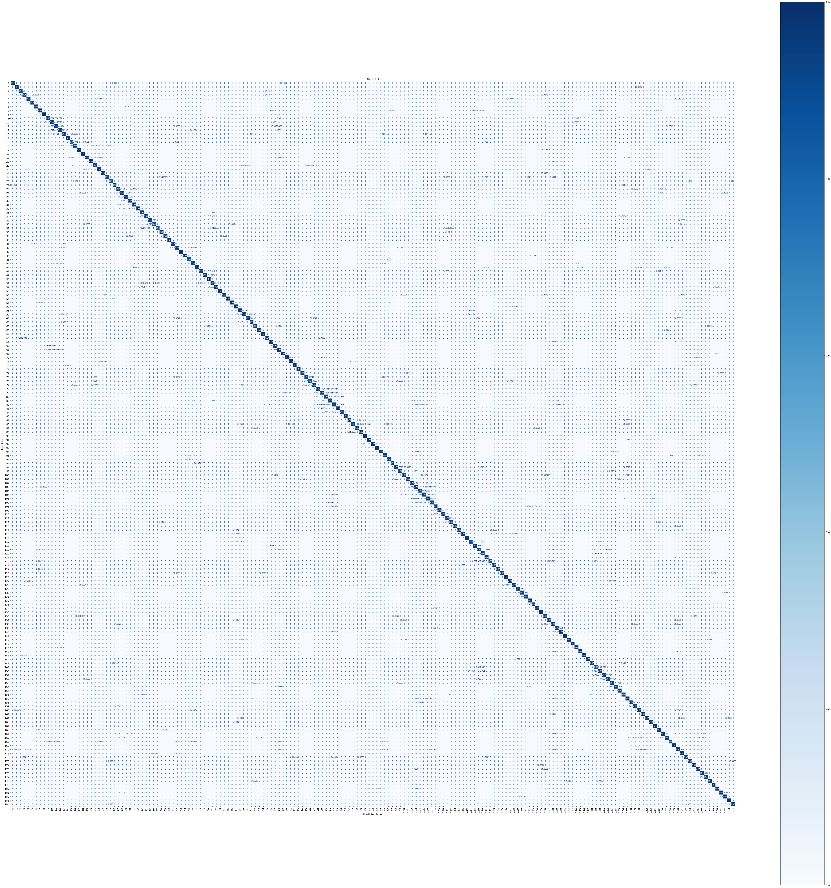

# Fishial.ai

This project includes training and validation scripts for the fish segmentation and classification model.

[Demo web aplication](https://portal.fishial.ai/search/by-fishial-recognition)

Project website: www.fishial.ai

## Installation

Install the dependencies.

```sh
$ pip3 install -r requirements.txt
```

## Getting Started

* [Runner.ipynb](Runner.ipynb) This jupyter notebook allows you to run segmentation and classification neural networks on Google Cloud or your computer, after downloading the files from the links below.

* [auto_train_cross.py](train_scripts/classification/auto_train_cross.py) is the script performs training automatically with different parameters the selected model using the cross entropy loss function. The checkpoint with the best performance on the validation dataset is saved to the output folder.

* [auto_train_triplet.py](train_scripts/classification/auto_train_triplet.py) is the script performs training automatically with different the selected model using the (Triplet Quadruplet) loss function. The checkpoint with the best performance on the validation dataset according k-metric is saved to the output folder.

* [auto_train_cross.py](train_scripts/classification/auto_train_cross.py) is the script cut your dataset to specific maximum and minimum count images per class to the arbitrary way.

* [train.py](train_scripts/segmentation/train.py) is the basic set up script to train segmentation model using Detectrin2 API 

* [train_copy_paste.py](train_scripts/segmentation/train_copy_paste.py) is the basic set up script to train segmentation model using Detectrin2 API with Copy Paste Augumentation.

* ([model.py](module/classification_package/src/model.py), [utils.py](module/classification_package/src/utils.py)): These files contain the main classification pipline implementation.

* [CreateDataBaseTensor.py](helper/classification/CreateDataBaseTensor.py): This script is designed to get the attachment tensor for a trained neural network, the resulting tensor has dimensions {number of classes * maximum number of images for one class * embedding dimension} for classes in which the number of attachments is less than in the maximum class, a tensor with a value of 100 is added in order not to affect for inference

* [CreateDatasetAndTrain.py](helper/classification/CreateDatasetAndTrain.ipynb): This script allows you to create a training and test data set from the exported fishial coco file and train the neural network

## Models

| Model | link  |
| ------------- | ------------- |
| MaskRCNN Fish Segmentation (Update 29.06.2022)  | [link](https://storage.googleapis.com/fishial-ml-resources/models_29.06.2022/model_0259999.pth) |
| ResNet18 Fish Classification Cross Entropy V1.0 | [link](https://storage.googleapis.com/fishial-ml-resources/final_cross_cross_entropy_0.9923599320882852_258571.0.ckpt) |
| ResNet18 Binary Classification  | [link](https://storage.cloud.google.com/fishial-ml-resources/binary_class.ckpt) |
| ResNet18 Fish Classification Embedding 256 V2.0  | [link](https://storage.googleapis.com/fishial-ml-resources/models_29.06.2022/full_256.ckpt) |
| ResNet18 DataBase Tensor  | [link](https://storage.googleapis.com/fishial-ml-resources/models_29.06.2022/train%2Btest_embedding.pt) |
| ResNet18 v4 model pack 184 classes (latest) | [link](https://storage.googleapis.com/fishial-ml-resources/classification_v5.zip) |
| MaskRCNN Fish Segmentation (Update 15.11.2022) (latest)  | [link](https://storage.googleapis.com/fishial-ml-resources/model_15_11_2022.pth) |


## [Train results](train_scripts/README.md)


Segmentation model has validated by mAP metric.

**MaskRCNN **

| AP | AP50  | AP75 | APs | APm | APl | 
| ------------- | ------------- | ------------- | ------------- | ------------- | ------------- |
| 82.504  | 96.742 | 94.727 | 13.283 | 58.029 | 84.540 |


**Classification model**

Names of fish classes in tensor
```json
{"0": "Sciaenops ocellatus", "1": "Centropomus undecimalis", "2": "Haemulon plumierii", "3": "Lutjanus analis", "4": "Lutjanus synagris", "5": "Coryphaena hippurus", "6": "Oncorhynchus mykiss", "7": "Pterois volitans", "8": "Sphyraena barracuda", "9": "Micropterus salmoides", "10": "Salvelinus fontinalis", "11": "Morone saxatilis", "12": "Rhincodon typus", "13": "Scomberomorus cavalla", "14": "Thunnus albacares", "15": "Megalops atlanticus", "16": "Micropterus dolomieu", "17": "Salmo trutta", "18": "Makaira nigricans", "19": "Carassius auratus", "20": "Oncorhynchus nerka", "21": "Ocyurus chrysurus", "22": "Strongylura marina", "23": "Atractosteus spatula", "24": "Perca fluviatilis", "25": "Carcharhinus plumbeus", "26": "Balistes capriscus", "27": "Pomoxis nigromaculatus", "28": "Sander vitreus", "29": "Abramis brama", "30": "Lutjanus campechanus", "31": "Scomber scombrus", "32": "Carpiodes carpio", "33": "Mycteroperca bonaci", "34": "Acanthocybium solandri", "35": "Cyprinus carpio", "36": "Rachycentron canadum", "37": "Leiostomus xanthurus", "38": "Centropristis striata", "39": "Caranx hippos", "40": "Caranx latus", "41": "Elops saurus", "42": "Epinephelus morio", "43": "Lobotes surinamensis", "44": "Scomberomorus maculatus", "45": "Trachinotus falcatus", "46": "Seriola dumerili", "47": "Oncorhynchus kisutch", "48": "Lachnolaimus maximus", "49": "Alectis ciliaris", "50": "Pomatomus saltatrix", "51": "Caranx crysos", "52": "Opisthonema oglinum", "53": "Oncorhynchus tshawytscha", "54": "Salmo salar", "55": "Esox lucius", "56": "Cynoscion nebulosus", "57": "Lutjanus griseus", "58": "Synodus foetens", "59": "Lepomis gulosus", "60": "Lepomis gibbosus", "61": "Perca flavescens", "62": "Morone chrysops", "63": "Lepomis auritus", "64": "Lepomis cyanellus", "65": "Tylosurus crocodilus", "66": "Menticirrhus americanus", "67": "Menticirrhus saxatilis", "68": "Mycteroperca microlepis", "69": "Paralichthys dentatus", "70": "Prionotus evolans", "71": "Paralichthys lethostigma", "72": "Amia calva", "73": "Lepisosteus osseus", "74": "Lepomis macrochirus", "75": "Esox niger", "76": "Ameiurus nebulosus", "77": "Ameiurus natalis", "78": "Ambloplites rupestris", "79": "Catostomus commersonii", "80": "Ameiurus catus", "81": "Semotilus atromaculatus", "82": "Anguilla rostrata", "83": "Moxostoma macrolepidotum", "84": "Oncorhynchus gorbuscha", "85": "Cyprinus carpio carpio", "86": "Thunnus atlanticus", "87": "Lutjanus argentimaculatus", "88": "Pomoxis annularis", "89": "Sander canadensis", "90": "Stenotomus chrysops", "91": "Aplodinotus grunniens", "92": "Ictalurus punctatus", "93": "Trachinotus carolinus", "94": "Lagodon rhomboides", "95": "Tautoga onitis", "96": "Bagre marinus", "97": "Ariopsis felis", "98": "Esox masquinongy", "99": "Ameiurus melas", "100": "Salvelinus namaycush", "101": "Pogonias cromis", "102": "Micropogonias undulatus", "103": "Archosargus probatocephalus", "104": "Sphyrna tiburo", "105": "Alosa sapidissima", "106": "Acipenser fulvescens", "107": "Acipenser transmontanus", "108": "Micropterus punctulatus", "109": "Cichla ocellaris", "110": "Oreochromis aureus", "111": "Ophiodon elongatus", "112": "Merlangius merlangus", "113": "Scomber japonicus", "114": "Paralichthys californicus", "115": "Paralabrax clathratus", "116": "Lates calcarifer", "117": "Ictalurus furcatus", "118": "Morone americana", "119": "Rutilus rutilus", "120": "Carcharhinus limbatus", "121": "Pylodictis olivaris", "122": "Dicentrarchus labrax", "123": "Oncorhynchus clarkii", "124": "Platycephalus fuscus", "125": "Lepomis microlophus", "126": "Ctenopharyngodon idella", "127": "Clarias gariepinus", "128": "Silurus glanis", "129": "Lutjanus fulviflamma", "130": "Lutjanus bohar", "131": "Gymnosarda unicolor", "132": "Barbus barbus", "133": "Carassius carassius", "134": "Tilapia sparrmanii", "135": "Micropterus floridanus", "136": "Micropterus treculii", "137": "Lepomis megalotis", "138": "Micropterus coosae", "139": "Belone belone", "140": "Scyliorhinus canicula", "141": "Triakis semifasciata", "142": "Caranx ignobilis", "143": "Cichlasoma urophthalmus", "144": "Mugil cephalus", "145": "Tinca tinca", "146": "Ictiobus bubalus", "147": "Gadus morhua", "148": "Acanthopagrus australis", "149": "Paralabrax maculatofasciatus", "150": "Lepisosteus oculatus", "151": "Caranx melampygus", "152": "Scardinius erythrophthalmus", "153": "Chrysophrys auratus", "154": "Seriola lalandi", "155": "Arripis trutta", "156": "Sander lucioperca", "157": "Dasyatis pastinaca", "158": "Pollachius pollachius", "159": "Caranx sexfasciatus", "160": "Semotilus corporalis", "161": "Macquaria ambigua", "162": "Lepisosteus platyrhincus", "163": "Dorosoma cepedianum", "164": "Labrus bergylta", "165": "Hypophthalmichthys molitrix", "166": "Rhabdosargus sarba", "167": "Prosopium williamsoni", "168": "Amphistichus argenteus", "169": "Sebastes melanops", "170": "Blicca bjoerkna", "171": "Paralabrax nebulifer", "172": "Anguilla anguilla", "173": "Mayaheros urophthalmus", "174": "Channa striata", "175": "Sphoeroides maculatus", "176": "Thymallus thymallus", "177": "Percalates novemaculeatus", "178": "Hephaestus fuliginosus", "179": "Maccullochella peelii", "180": "Esox americanus americanus", "181": "Acanthopagrus butcheri", "182": "Moxostoma anisurum", "183": "Cymatogaster aggregata", "184": "Channa marulius"}
```

**Cohen kappa:** 0.83

Confusion matrix:



<p float="left">
  
   
  
  
</p>


## License

[MIT](https://choosealicense.com/licenses/mit/)

