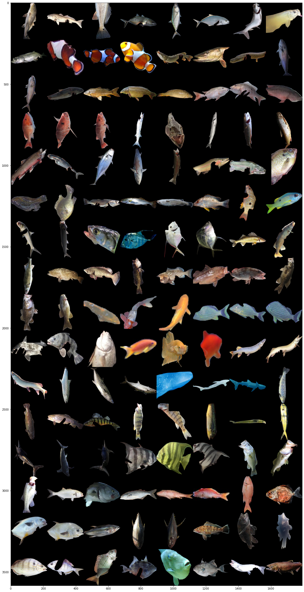

# Fishial.ai

This notebook shows insights of training experiments. 

---

### Data

&nbsp;&nbsp;&nbsp;&nbsp;&nbsp;&nbsp;At the moment, the fish collection contains more than 4000 images with around 10,000 polygons of fish for the task of instance segmentation, including around 60 species of fish with more than 10 polygons per class.

Image distribution:

<div style="width:200px">


</div>

#### Image samples

<div style="width:300px">


</div>


&nbsp;&nbsp;&nbsp;&nbsp;&nbsp;&nbsp;In the chart below, we can see that max images per class is about **80**, but in the source dataset was more than **400** , so we in arbitrary way cuted to max **50** images per class (for train set), so that make less imbalancing between classes.

---

### Balanced Batch Sampler

&nbsp;&nbsp;&nbsp;&nbsp;&nbsp;&nbsp;As we can observe in a chart below, our dataset has imbalanced data, some classes have more than 5 times more images than others, so to make a less sensitive to imbalanced dataset we apply BalancedBatchSampler.  By specifying count classes and images per class our sampler will generate a batch which will have specifically an exact amount of samples.

This class you can find here.
* [dataset.py/BalancedBatchSampler](../module/classification_package/src/dataset.py): This file contain realization of BalancedBatchSampler class.

---

### Data Augumentation

&nbsp;&nbsp;&nbsp;&nbsp;&nbsp;&nbsp;Next trick which we were using is augmentation data by transformation. Transformer has next functions:

```
loader = transforms.Compose([transforms.Resize((224, 224), Image.BILINEAR),
                                  transforms.TrivialAugmentWide(),
                                  transforms.RandomHorizontalFlip(),
                                  transforms.RandomVerticalFlip(),
                                  transforms.ToTensor(),
                                  transforms.RandomErasing(p=0.358, scale=(0.05, 0.4), ratio=(0.05, 6.1), value=0, inplace=False),
                                  transforms.Normalize([0.485, 0.456, 0.406], [0.229, 0.224, 0.225])])
```

&nbsp;&nbsp;&nbsp;&nbsp;&nbsp;&nbsp;So, how we can notice here, input image has size 224x224, in fact that CNN work better with float values, we apply **Normalize** function to convert int values to float values.

---

### Automatic Mixed Precision 

&nbsp;&nbsp;&nbsp;&nbsp;&nbsp;&nbsp;Automatic Mixed Precision gives faster training, so we implement them from the [nvidia library](https://github.com/NVIDIA/apex). 


```
model, opt = amp.initialize(models=model,
                                          optimizers=opt,
                                          opt_level='O2')
```

---

### Loss Function

#### Triplet, Qudruplet 
&nbsp;&nbsp;&nbsp;&nbsp;&nbsp;&nbsp;[Triplet loss](https://arxiv.org/pdf/1503.03832.pdf) network, is a common approach to retrieve images from a given set. Overall accuracy was pretty well on a validation set, additional advantages is adding new sample to dataset could improve ability to classification, but generally system had poore accuracy with small count images in classes. Quadruplet loss realized from [this paper](https://arxiv.org/pdf/1704.01719.pdf). 

Realization: 
* [Triplet, Quadruplet loss](../module/classification_package/src/loss_functions.py): This files contain realization of Triplet and Qudruplet loss class.

#### Cross entropy

&nbsp;&nbsp;&nbsp;&nbsp;&nbsp;&nbsp;In general, cross entropy proved to be a fairly stable solution, SGD was used as an optimizer. Batch balancing and augmentation reduced the retraining effect of this.

 ---
 
### Train Results

Confusion matrix:

<div style="width:500px">


</div>

Score Table:


| Class | precision  | recall | f1-score | support |
| -------------: | ------------- | ------------- | ------------- | ------------- |
| Pomatomus saltatrix | 0.95 | 0.87 | 0.91 | 70 |
| Acanthocybium solandri | 0.78 | 0.88 | 0.82 | 48 |
| Carassius auratus | 0.74 | 0.93 | 0.82 | 15 |
| Caranx hippos | 0.80 | 0.89 | 0.84 | 18 |
| Thunnus atlanticus | 0.59 | 0.91 | 0.71 | 11 |
| Perca flavescens | 0.82 | 1.00 | 0.90 | 14 |
| Salvelinus fontinalis | 0.68 | 0.88 | 0.77 | 17 |
| Oncorhynchus mykiss | 0.93 | 0.85 | 0.89 | 135 |
| Esox lucius | 0.55 | 0.86 | 0.67 | 14 |
| Pterois volitans | 0.92 | 0.88 | 0.82 | 12 |
| Sphyraena barracuda | 0.83 | 0.89 | 0.86 | 27 |
| Lepomis macrochirus | 0.82 | 0.86 | 0.84 | 21 |
| Pogonias cromis | 0.71 | 0.81 | 0.76 | 31 |
| Sciaenops ocellatus | 0.97 | 0.87 | 0.92 | 120 |
| Lepomis gulosus | 0.48 | 1.00 | 0.65 | 10 |
| Esox masquinongy | 0.90 | 0.83 | 0.86 | 23 |
| Salmo trutta | 0.44 | 0.85 | 0.58 | 13 |
| Scomberomorus cavalla | 0.85 | 0.76 | 0.81 | 38 |
| Micropterus salmoides | 0.94 | 0.83 | 0.88 | 151 |
| Coryphaena hippurus | 0.97 | 0.93 | 0.95 | 158 |
| Micropterus dolomieu | 0.89 | 0.84 | 0.86 | 137 |
| Balistes capriscus | 1.00 | 0.60 | 0.75 | 5 |
| Thunnus albacares | 0.80 | 0.50 | 0.62 | 8 |
| Megalops atlanticus | 0.62 | 0.83 | 0.71 | 6 |
| Trachinotus falcatus | 0.83 | 1.00 | 0.91 | 5 |
| Morone saxatilis | 0.83 | 1.00 | 0.91 | 5 |
| Seriola dumerili | 1.00 | 0.60 | 0.75 | 5 |
| Caranx crysos | 0.00 | 0.00 | 0.00 | 5 |
| Lutjanus vivanus | 0.83 | 1.00 | 0.91 | 5 |
| Scomberomorus maculatus | 0.50 | 0.83 | 0.62 | 6 |
| Rachycentron canadum | 0.56 | 0.83 | 0.67 | 6 |
| Amphiprion percula | 0.80 | 0.80 | 0.80 | 5 |
| Haemulon sciurus | 1.00 | 1.00 | 1.00 | 5 |
| Lutjanus synagris | 0.80 | 0.80 | 0.80 | 5 |
| Lutjanus campechanus | 1.00 | 1.00 | 1.00 | 5 |
| Istiophorus albicans | 0.75 | 0.60 | 0.67 | 6 |
| Cynoscion nebulosus | 0.67 | 0.80 | 0.73 | 5 |
| Elops saurus | 0.67 | 0.40 | 0.50 | 5 |
| Carcharias taurus | 1.00 | 1.00 | 1.00 | 5 |
| Lutjanus griseus | 1.00 | 0.60 | 0.75 | 5 |
| Cyprinus carpio | 0.80 | 0.80 | 0.80 | 5 |
| Selene vomer | 0.67 | 0.80 | 0.73 | 5 |
| Centropristis striata | 0.67 | 0.86 | 0.75 | 7 |
| Caranx ruber | 0.67 | 0.80 | 0.73 | 5 |
| Epinephelus morio | 0.67 | 0.80 | 0.73 | 5 |
| Amphiprion ocellaris | 0.80 | 0.80 | 0.80 | 5 |
| Carcharodon carcharias | 0.75 | 0.60 | 0.67 | 5 |
| Chaetodipterus faber | 0.83 | 1.00 | 0.91 | 5 |
| Mycteroperca microlepis | 1.00 | 0.60 | 0.75 | 5 |
| Lagodon rhomboides | 0.67 | 0.40 | 0.50 | 5 |
| Archosargus probatocephalus | 0.80 | 1.00 | 0.89 | 8 |
| Lobotes surinamensis | 0.75 | 0.60 | 0.67 | 5 |
| Xiphias gladius | 0.33 | 0.20 | 0.25 | 5 |
| Pomoxis nigromaculatus | 0.67 | 0.80 | 0.73 | 5 |
| Sander vitreus | 1.00 | 0.20 | 0.33 | 5 |
| Rhincodon typus | 0.78 | 0.88 | 0.82 | 8 |
| Oncorhynchus kisutch | 0.50 | 0.40 | 0.44 | 5 |
| Katsuwonus pelamis | 0.67 | 0.40 | 0.50 | 5 |
| Euthynnus alletteratus | 0.50 | 1.00 | 0.67 | 8 |
| Lutjanus analis | 1.00 | 1.00 | 1.00 | 7 |
| Cyprinus rubrofuscus | 0.60 | 1.00 | 0.75 | 6 |


<p float="left">
  
   
  
  
</p>


## License

[MIT](https://choosealicense.com/licenses/mit/)

