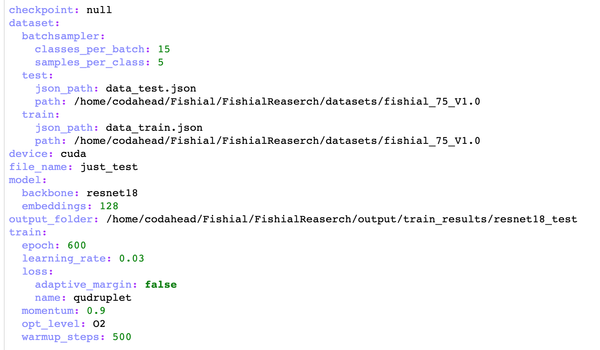
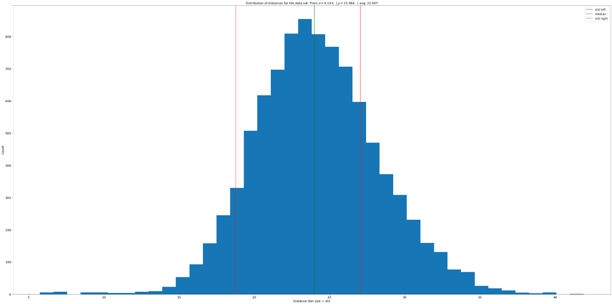
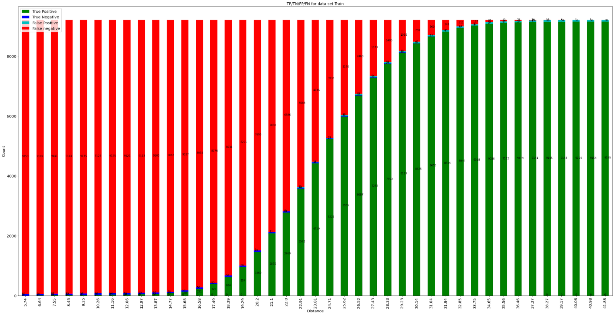
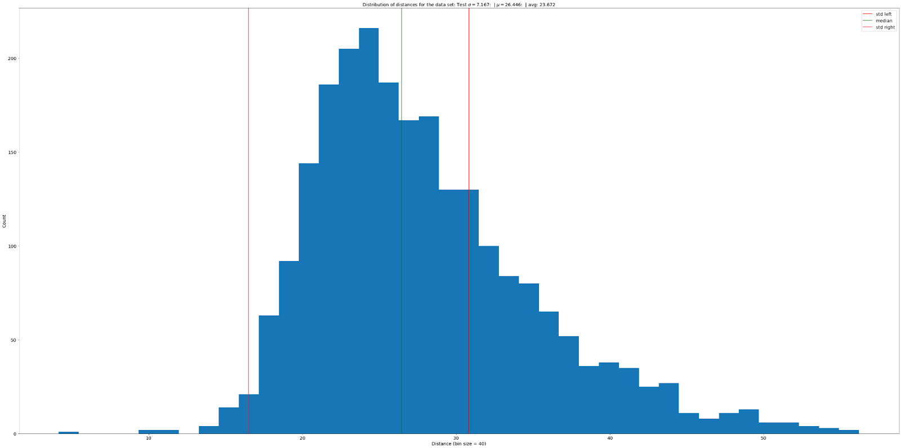
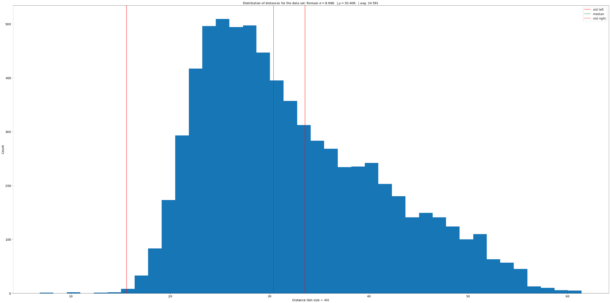
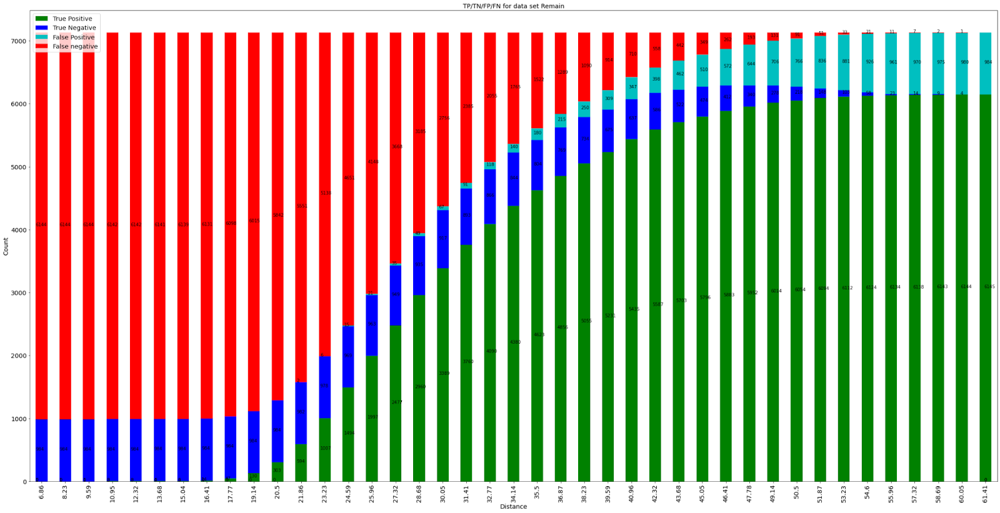
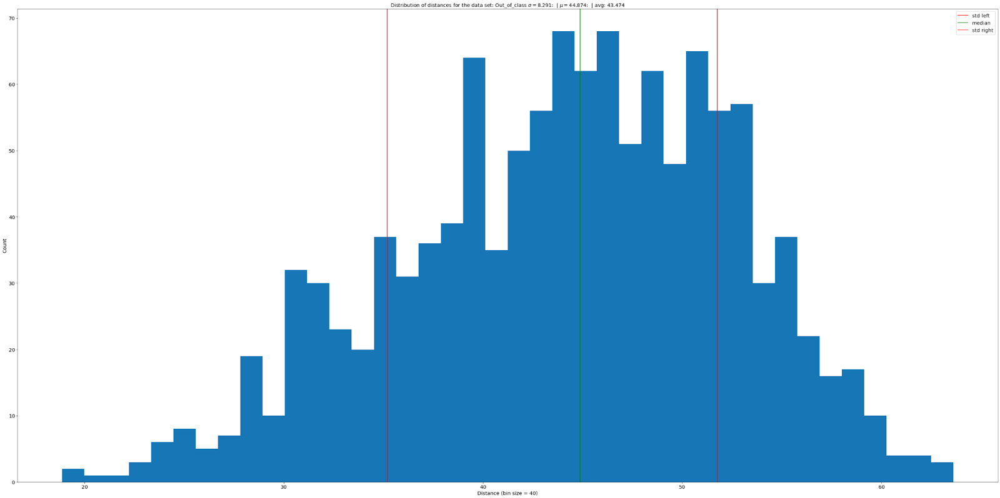
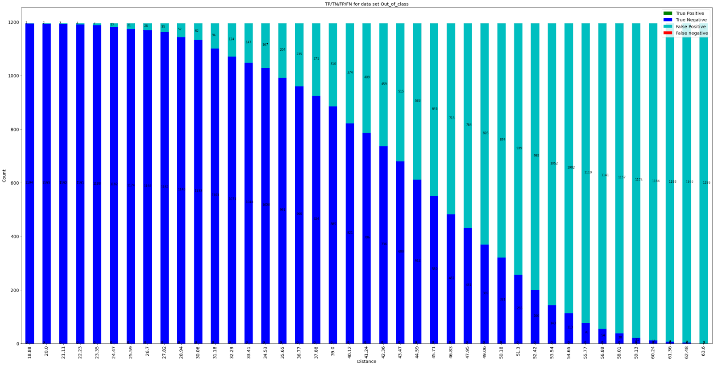
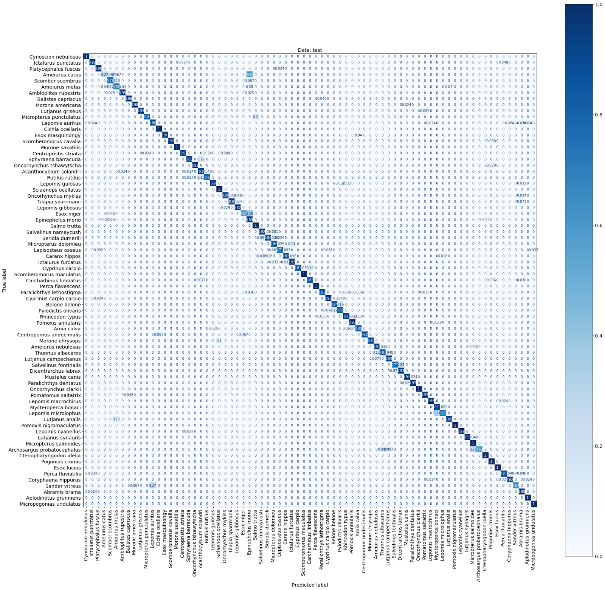
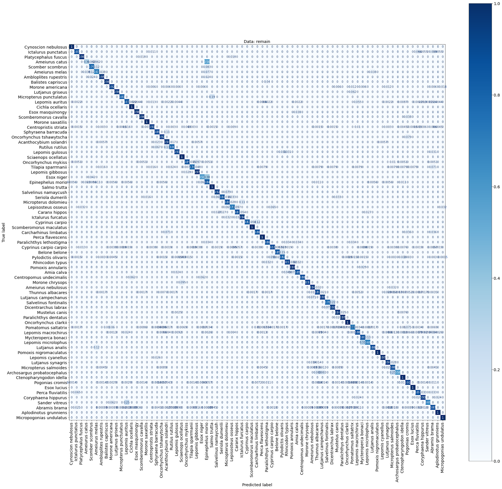

# Fishial.ai

This notebook shows insights of training experiments. 

---

**Trained Model Report**

1. **Data**

In this experiment, we decomposed the entire exported Fishial dataset into 4 datasets (Train/Test/Remain/Out of Class). Classes with the largest number of images with the ODM flag were selected as target classes for recognition.

    1. **Train/Test**

As a training sample, 75 classes were selected that have the following characteristics: The maximum number of photos is 211, the number of photos for testing is 20% but not less than 15.

    2. **‘Remain’**

	This dataset had all other photos for the selected classes including and not including the ODM flag.

    3. **‘Out of Class’**

	This dataset had all out-of-class images (about 300 different classes) with a low number of instances for each class. This set was chosen in order to check the quality of work on classes that do not participate in the learning process, which thereby gives us an idea of the ability of a neural network to cluster previously unknown classes in hyperspace.

	

2. **Model description.**

Feature Network (backbone): **ResNet18**

Classification Layer (embedding): **128 neurons**

Loss: **Quadruplet loss**

Setup: 

3. **Train results **

To check the quality of the model, the **F1-score** method was chosen. Vector neural networks do not return the probability of belonging to a certain class, but only a vector representation of the image, and the next step is to search for the most similar image in the desired class among all elements in the database, thus such networks can be called self-learning, provided that new ones are added to the database validated images, but when new classes are added, retraining is still required. 

The L1 metric (Manhattan distance) was used to search for the most similar image from the database.

For additional improvement (elimination of false positives on classes that did not take part in training), a method was developed to find the best threshold of acceptable distance with the optimal value.

<table>
  <tr>
   <td><strong>Dataset</strong>
   </td>
   <td><strong>Threshold</strong>
   </td>
   <td><strong> F1 score</strong>
   </td>
  </tr>
  <tr>
   <td>Train
   </td>
   <td>36.50303200089144
   </td>
   <td>1.0
   </td>
  </tr>
  <tr>
   <td>Test
   </td>
   <td>43.02331613758524
   </td>
   <td>0.962000962000962
   </td>
  </tr>
  <tr>
   <td>Remain
   </td>
   <td>30.634776277867015
   </td>
   <td>1.0
   </td>
  </tr>
  <tr>
   <td>Out of class
   </td>
   <td>0.0
   </td>
   <td>0.0
   </td>
  </tr>
</table>

Only the training data set was used as a** knowledge base** and distances 0 were cut off because most likely these distances appear in the case of identical photos.

In the table for the "Out of class" data set, we can notice that the metric has a value of 0, all because there cannot be true positive (**TP**) results in this set, which means that the metric is not representative. The number of nearest neighbors was: **5**

**TRAIN**

In order to better evaluate the mechanics of the trained network, we present the following graphs: A histogram of the distribution of distances for the whole data set and a change in the truth map depending on the distance threshold.

**coefficient variance: 0.17094201770111886**

**68–95–99.7 rule: |0.6902770233568712|0.9400325909831613|0.9917436175991309|**

For the training dataset, as we can see, the histogram looks good according to the Gaussian distribution, which means that for this data, the neural network performs very well.

**TEST**

**coefficient variance:** 0.25709614804267034

**68–95–99.7 rule:** |0.7024369388627618|0.904232578024797|0.9747755451047456|

**Remain**

**coefficient variance: 0.2775085208648267**

**68–95–99.7 rule: |0.6155140973488568|0.8435965773600785|0.9694206761116566|**

**Out of class**

In this data set, all elements were not included in the selected classes, which means we can determine with what probability at what threshold level our model will be wrong on out-of-class data.

As we can see the average value is significantly higher than on the previous three datasets **44.874** vs. **23.984, 26.446, 30.408** for training, testing and others respectively which indicates that the network has not overfitting and the resulting features in the vector have a strong dependence.

**coefficient variance: 0.1876613292578638**

**68–95–99.7 rule: |0.6476987447698744|0.9682008368200837|1.0|**

**Confusion matrix**

**Distribution within classes for different datasets**

<table>
  <tr>
   <td>Name
   </td>
   <td colspan="4" ><strong>Train</strong>
   </td>
   <td colspan="4" ><strong>Test</strong>
   </td>
   <td colspan="4" ><strong>Remain</strong>
   </td>
  </tr>
  <tr>
   <td>
   </td>
   <td><strong>CNT</strong>
   </td>
   <td><strong>STD</strong>
   </td>
   <td><strong>MEAN</strong>
   </td>
   <td><strong>MEDIAN</strong>
   </td>
   <td><strong>CNT</strong>
   </td>
   <td><strong>STD</strong>
   </td>
   <td><strong>MEAN</strong>
   </td>
   <td><strong>MEDIAN</strong>
   </td>
   <td><strong>CNT</strong>
   </td>
   <td><strong>STD</strong>
   </td>
   <td><strong>MEAN</strong>
   </td>
   <td><strong>MEDIAN</strong>
   </td>
  </tr>
  <tr>
   <td><strong>Acanthocybium solandri</strong>
   </td>
   <td>

28392

   </td>
   <td>

6.59

   </td>
   <td>

38.51

   </td>
   <td>

38.07

   </td>
   <td>

1722

   </td>
   <td>

10.18

   </td>
   <td>

41.09

   </td>
   <td>

39.89

   </td>
   <td>

19182

   </td>
   <td>

11.35

   </td>
   <td>

48.67

   </td>
   <td>

47.36

   </td>
  </tr>
  <tr>
   <td><strong>Lutjanus synagris</strong>
   </td>
   <td>

21756

   </td>
   <td>

6.16

   </td>
   <td>

33.67

   </td>
   <td>

33.43

   </td>
   <td>

1332

   </td>
   <td>

9.04

   </td>
   <td>

35.19

   </td>
   <td>

34.12

   </td>
   <td>

0

   </td>
   <td>
   </td>
   <td>
   </td>
   <td>
   </td>
  </tr>
  <tr>
   <td><strong>Salvelinus fontinalis</strong>
   </td>
   <td>

28392

   </td>
   <td>

6.53

   </td>
   <td>

38.61

   </td>
   <td>

38.49

   </td>
   <td>

1722

   </td>
   <td>

7.4

   </td>
   <td>

37.73

   </td>
   <td>

37.12

   </td>
   <td>

32942

   </td>
   <td>

14.27

   </td>
   <td>

52.1

   </td>
   <td>

50.21

   </td>
  </tr>
  <tr>
   <td><strong>Centropristis striata</strong>
   </td>
   <td>

11130

   </td>
   <td>

6.37

   </td>
   <td>

36.2

   </td>
   <td>

35.98

   </td>
   <td>

650

   </td>
   <td>

10.45

   </td>
   <td>

47.07

   </td>
   <td>

47.56

   </td>
   <td>

0

   </td>
   <td>
   </td>
   <td>
   </td>
   <td>
   </td>
  </tr>
  <tr>
   <td><strong>Centropomus undecimalis</strong>
   </td>
   <td>

9900

   </td>
   <td>

5.84

   </td>
   <td>

33.67

   </td>
   <td>

33.19

   </td>
   <td>

600

   </td>
   <td>

10.31

   </td>
   <td>

38.05

   </td>
   <td>

36.16

   </td>
   <td>

0

   </td>
   <td>
   </td>
   <td>
   </td>
   <td>
   </td>
  </tr>
  <tr>
   <td><strong>Micropterus punctulatus</strong>
   </td>
   <td>

23870

   </td>
   <td>

6.24

   </td>
   <td>

34.25

   </td>
   <td>

33.88

   </td>
   <td>

1406

   </td>
   <td>

8.22

   </td>
   <td>

39.51

   </td>
   <td>

38.22

   </td>
   <td>

0

   </td>
   <td>
   </td>
   <td>
   </td>
   <td>
   </td>
  </tr>
  <tr>
   <td><strong>Micropterus dolomieu</strong>
   </td>
   <td>

28392

   </td>
   <td>

6.57

   </td>
   <td>

37.73

   </td>
   <td>

37.54

   </td>
   <td>

1722

   </td>
   <td>

12.57

   </td>
   <td>

44.22

   </td>
   <td>

42.49

   </td>
   <td>

232806

   </td>
   <td>

14.56

   </td>
   <td>

50.69

   </td>
   <td>

47.97

   </td>
  </tr>
  <tr>
   <td><strong>Cyprinus carpio</strong>
   </td>
   <td>

28392

   </td>
   <td>

6.09

   </td>
   <td>

37.96

   </td>
   <td>

37.81

   </td>
   <td>

1722

   </td>
   <td>

13.13

   </td>
   <td>

46.67

   </td>
   <td>

43.74

   </td>
   <td>

17556

   </td>
   <td>

9.93

   </td>
   <td>

43.6

   </td>
   <td>

42.14

   </td>
  </tr>
  <tr>
   <td><strong>Rutilus rutilus</strong>
   </td>
   <td>

21756

   </td>
   <td>

6.47

   </td>
   <td>

36.36

   </td>
   <td>

35.76

   </td>
   <td>

1332

   </td>
   <td>

8.22

   </td>
   <td>

40.9

   </td>
   <td>

40.44

   </td>
   <td>

0

   </td>
   <td>
   </td>
   <td>
   </td>
   <td>
   </td>
  </tr>
  <tr>
   <td><strong>Lutjanus campechanus</strong>
   </td>
   <td>

5256

   </td>
   <td>

6.62

   </td>
   <td>

36.92

   </td>
   <td>

36.74

   </td>
   <td>

342

   </td>
   <td>

8

   </td>
   <td>

40.93

   </td>
   <td>

40.05

   </td>
   <td>

0

   </td>
   <td>
   </td>
   <td>
   </td>
   <td>
   </td>
  </tr>
  <tr>
   <td><strong>Ameiurus nebulosus</strong>
   </td>
   <td>

10302

   </td>
   <td>

5.57

   </td>
   <td>

38.88

   </td>
   <td>

38.75

   </td>
   <td>

600

   </td>
   <td>

13.69

   </td>
   <td>

52.79

   </td>
   <td>

52.35

   </td>
   <td>

0

   </td>
   <td>
   </td>
   <td>
   </td>
   <td>
   </td>
  </tr>
  <tr>
   <td><strong>Mustelus canis</strong>
   </td>
   <td>

420

   </td>
   <td>

4.65

   </td>
   <td>

34.71

   </td>
   <td>

34.61

   </td>
   <td>

210

   </td>
   <td>

8.66

   </td>
   <td>

47.43

   </td>
   <td>

46.56

   </td>
   <td>

0

   </td>
   <td>
   </td>
   <td>
   </td>
   <td>
   </td>
  </tr>
  <tr>
   <td><strong>Oncorhynchus clarkii</strong>
   </td>
   <td>

14520

   </td>
   <td>

5.86

   </td>
   <td>

36.42

   </td>
   <td>

36.23

   </td>
   <td>

870

   </td>
   <td>

6.64

   </td>
   <td>

41.61

   </td>
   <td>

41.04

   </td>
   <td>

0

   </td>
   <td>
   </td>
   <td>
   </td>
   <td>
   </td>
  </tr>
  <tr>
   <td><strong>Coryphaena hippurus</strong>
   </td>
   <td>

28392

   </td>
   <td>

6.28

   </td>
   <td>

37.3

   </td>
   <td>

37.03

   </td>
   <td>

1722

   </td>
   <td>

17.65

   </td>
   <td>

51.13

   </td>
   <td>

47.11

   </td>
   <td>

391250

   </td>
   <td>

11.61

   </td>
   <td>

49.85

   </td>
   <td>

48.63

   </td>
  </tr>
  <tr>
   <td><strong>Lepomis cyanellus</strong>
   </td>
   <td>

28392

   </td>
   <td>

6.25

   </td>
   <td>

33.38

   </td>
   <td>

32.96

   </td>
   <td>

1722

   </td>
   <td>

9.58

   </td>
   <td>

41.49

   </td>
   <td>

41.53

   </td>
   <td>

342

   </td>
   <td>

29.96

   </td>
   <td>

53.05

   </td>
   <td>

39.12

   </td>
  </tr>
  <tr>
   <td><strong>Scomber scombrus</strong>
   </td>
   <td>

4970

   </td>
   <td>

5.98

   </td>
   <td>

35.75

   </td>
   <td>

35.65

   </td>
   <td>

306

   </td>
   <td>

8.52

   </td>
   <td>

40.93

   </td>
   <td>

41.05

   </td>
   <td>

0

   </td>
   <td>
   </td>
   <td>
   </td>
   <td>
   </td>
  </tr>
  <tr>
   <td><strong>Ctenopharyngodon idella</strong>
   </td>
   <td>

4692

   </td>
   <td>

5.1

   </td>
   <td>

35.18

   </td>
   <td>

35.02

   </td>
   <td>

272

   </td>
   <td>

7.46

   </td>
   <td>

36.68

   </td>
   <td>

35.8

   </td>
   <td>

0

   </td>
   <td>
   </td>
   <td>
   </td>
   <td>
   </td>
  </tr>
  <tr>
   <td><strong>Cichla ocellaris</strong>
   </td>
   <td>

14762

   </td>
   <td>

6.09

   </td>
   <td>

34.35

   </td>
   <td>

33.98

   </td>
   <td>

870

   </td>
   <td>

8.84

   </td>
   <td>

39.64

   </td>
   <td>

38.96

   </td>
   <td>

0

   </td>
   <td>
   </td>
   <td>
   </td>
   <td>
   </td>
  </tr>
  <tr>
   <td><strong>Belone belone</strong>
   </td>
   <td>

870

   </td>
   <td>

5.5

   </td>
   <td>

35.73

   </td>
   <td>

35.42

   </td>
   <td>

210

   </td>
   <td>

11.96

   </td>
   <td>

49.08

   </td>
   <td>

45.68

   </td>
   <td>

0

   </td>
   <td>
   </td>
   <td>
   </td>
   <td>
   </td>
  </tr>
  <tr>
   <td><strong>Lepomis microlophus</strong>
   </td>
   <td>

14762

   </td>
   <td>

5.74

   </td>
   <td>

34.73

   </td>
   <td>

34.55

   </td>
   <td>

870

   </td>
   <td>

8.92

   </td>
   <td>

37.26

   </td>
   <td>

35.82

   </td>
   <td>

0

   </td>
   <td>
   </td>
   <td>
   </td>
   <td>
   </td>
  </tr>
  <tr>
   <td><strong>Archosargus probatocephalus</strong>
   </td>
   <td>

28392

   </td>
   <td>

6.68

   </td>
   <td>

36.43

   </td>
   <td>

36.04

   </td>
   <td>

1722

   </td>
   <td>

9.38

   </td>
   <td>

38.18

   </td>
   <td>

37.21

   </td>
   <td>

15500

   </td>
   <td>

16.04

   </td>
   <td>

50.01

   </td>
   <td>

46.34

   </td>
  </tr>
  <tr>
   <td><strong>Cyprinus carpio carpio</strong>
   </td>
   <td>

1190

   </td>
   <td>

4.61

   </td>
   <td>

35.42

   </td>
   <td>

35.42

   </td>
   <td>

210

   </td>
   <td>

9.66

   </td>
   <td>

50.09

   </td>
   <td>

48.82

   </td>
   <td>

0

   </td>
   <td>
   </td>
   <td>
   </td>
   <td>
   </td>
  </tr>
  <tr>
   <td><strong>Pomoxis annularis</strong>
   </td>
   <td>

28392

   </td>
   <td>

5.99

   </td>
   <td>

35.19

   </td>
   <td>

34.98

   </td>
   <td>

1722

   </td>
   <td>

7.05

   </td>
   <td>

40.52

   </td>
   <td>

40.44

   </td>
   <td>

12

   </td>
   <td>

14.51

   </td>
   <td>

59.31

   </td>
   <td>

63.1

   </td>
  </tr>
  <tr>
   <td><strong>Sander vitreus</strong>
   </td>
   <td>

28392

   </td>
   <td>

6.91

   </td>
   <td>

38.86

   </td>
   <td>

38.79

   </td>
   <td>

1722

   </td>
   <td>

9.12

   </td>
   <td>

43.33

   </td>
   <td>

42.63

   </td>
   <td>

6

   </td>
   <td>

1.06

   </td>
   <td>

41.56

   </td>
   <td>

41.96

   </td>
  </tr>
  <tr>
   <td><strong>Perca fluviatilis</strong>
   </td>
   <td>

20592

   </td>
   <td>

5.86

   </td>
   <td>

35.99

   </td>
   <td>

35.75

   </td>
   <td>

1190

   </td>
   <td>

8.22

   </td>
   <td>

41.4

   </td>
   <td>

40.62

   </td>
   <td>

0

   </td>
   <td>
   </td>
   <td>
   </td>
   <td>
   </td>
  </tr>
  <tr>
   <td><strong>Esox masquinongy</strong>
   </td>
   <td>

28392

   </td>
   <td>

7.13

   </td>
   <td>

34.8

   </td>
   <td>

34.25

   </td>
   <td>

1722

   </td>
   <td>

13.35

   </td>
   <td>

42.02

   </td>
   <td>

39.86

   </td>
   <td>

6972

   </td>
   <td>

14.49

   </td>
   <td>

58.45

   </td>
   <td>

57.28

   </td>
  </tr>
  <tr>
   <td><strong>Paralichthys lethostigma</strong>
   </td>
   <td>

11556

   </td>
   <td>

6.43

   </td>
   <td>

35.63

   </td>
   <td>

35.18

   </td>
   <td>

702

   </td>
   <td>

8.67

   </td>
   <td>

38.93

   </td>
   <td>

38.51

   </td>
   <td>

0

   </td>
   <td>
   </td>
   <td>
   </td>
   <td>
   </td>
  </tr>
  <tr>
   <td><strong>Lepisosteus osseus</strong>
   </td>
   <td>

9120

   </td>
   <td>

6.39

   </td>
   <td>

36.48

   </td>
   <td>

36.32

   </td>
   <td>

506

   </td>
   <td>

7.31

   </td>
   <td>

44.44

   </td>
   <td>

44.52

   </td>
   <td>

0

   </td>
   <td>
   </td>
   <td>
   </td>
   <td>
   </td>
  </tr>
  <tr>
   <td><strong>Esox niger</strong>
   </td>
   <td>

19460

   </td>
   <td>

7.14

   </td>
   <td>

37.27

   </td>
   <td>

37.52

   </td>
   <td>

1190

   </td>
   <td>

7.9

   </td>
   <td>

41.24

   </td>
   <td>

41.25

   </td>
   <td>

0

   </td>
   <td>
   </td>
   <td>
   </td>
   <td>
   </td>
  </tr>
  <tr>
   <td><strong>Oncorhynchus tshawytscha</strong>
   </td>
   <td>

12432

   </td>
   <td>

5.96

   </td>
   <td>

38.26

   </td>
   <td>

37.86

   </td>
   <td>

702

   </td>
   <td>

8.5

   </td>
   <td>

50.98

   </td>
   <td>

50.68

   </td>
   <td>

0

   </td>
   <td>
   </td>
   <td>
   </td>
   <td>
   </td>
  </tr>
  <tr>
   <td><strong>Pomatomus saltatrix</strong>
   </td>
   <td>

28392

   </td>
   <td>

6.47

   </td>
   <td>

37.64

   </td>
   <td>

37.35

   </td>
   <td>

1722

   </td>
   <td>

9.38

   </td>
   <td>

48

   </td>
   <td>

47.93

   </td>
   <td>

510510

   </td>
   <td>

12.09

   </td>
   <td>

54.22

   </td>
   <td>

53.22

   </td>
  </tr>
  <tr>
   <td><strong>Pomoxis nigromaculatus</strong>
   </td>
   <td>

20592

   </td>
   <td>

6.2

   </td>
   <td>

35.86

   </td>
   <td>

35.49

   </td>
   <td>

1190

   </td>
   <td>

8.88

   </td>
   <td>

37.6

   </td>
   <td>

36.5

   </td>
   <td>

0

   </td>
   <td>
   </td>
   <td>
   </td>
   <td>
   </td>
  </tr>
  <tr>
   <td><strong>Scomberomorus maculatus</strong>
   </td>
   <td>

26732

   </td>
   <td>

7.45

   </td>
   <td>

35.92

   </td>
   <td>

35.89

   </td>
   <td>

1640

   </td>
   <td>

12.76

   </td>
   <td>

38.59

   </td>
   <td>

35.64

   </td>
   <td>

0

   </td>
   <td>
   </td>
   <td>
   </td>
   <td>
   </td>
  </tr>
  <tr>
   <td><strong>Platycephalus fuscus</strong>
   </td>
   <td>

8190

   </td>
   <td>

6.12

   </td>
   <td>

37.77

   </td>
   <td>

37.65

   </td>
   <td>

506

   </td>
   <td>

6.93

   </td>
   <td>

41.65

   </td>
   <td>

41.74

   </td>
   <td>

0

   </td>
   <td>
   </td>
   <td>
   </td>
   <td>
   </td>
  </tr>
  <tr>
   <td><strong>Perca flavescens</strong>
   </td>
   <td>

28392

   </td>
   <td>

6.47

   </td>
   <td>

37.2

   </td>
   <td>

36.84

   </td>
   <td>

1722

   </td>
   <td>

8.53

   </td>
   <td>

41.66

   </td>
   <td>

40.59

   </td>
   <td>

123552

   </td>
   <td>

9.78

   </td>
   <td>

44.45

   </td>
   <td>

43.1

   </td>
  </tr>
  <tr>
   <td><strong>Seriola dumerili</strong>
   </td>
   <td>

1122

   </td>
   <td>

5.97

   </td>
   <td>

35.65

   </td>
   <td>

35.34

   </td>
   <td>

210

   </td>
   <td>

14.07

   </td>
   <td>

52.32

   </td>
   <td>

50.07

   </td>
   <td>

0

   </td>
   <td>
   </td>
   <td>
   </td>
   <td>
   </td>
  </tr>
  <tr>
   <td><strong>Caranx hippos</strong>
   </td>
   <td>

28392

   </td>
   <td>

6.71

   </td>
   <td>

37.13

   </td>
   <td>

36.96

   </td>
   <td>

1722

   </td>
   <td>

15.25

   </td>
   <td>

48.16

   </td>
   <td>

45.64

   </td>
   <td>

172640

   </td>
   <td>

14.53

   </td>
   <td>

52.18

   </td>
   <td>

49.93

   </td>
  </tr>
  <tr>
   <td><strong>Ambloplites rupestris</strong>
   </td>
   <td>

28392

   </td>
   <td>

6

   </td>
   <td>

34.12

   </td>
   <td>

33.79

   </td>
   <td>

1722

   </td>
   <td>

6.82

   </td>
   <td>

37.38

   </td>
   <td>

36.92

   </td>
   <td>

156

   </td>
   <td>

14.23

   </td>
   <td>

43.25

   </td>
   <td>

41.39

   </td>
  </tr>
  <tr>
   <td><strong>Oncorhynchus mykiss</strong>
   </td>
   <td>

28392

   </td>
   <td>

6.3

   </td>
   <td>

38.26

   </td>
   <td>

37.97

   </td>
   <td>

1722

   </td>
   <td>

9.89

   </td>
   <td>

46.47

   </td>
   <td>

45.16

   </td>
   <td>

281430

   </td>
   <td>

12.08

   </td>
   <td>

51.03

   </td>
   <td>

49.85

   </td>
  </tr>
  <tr>
   <td><strong>Dicentrarchus labrax</strong>
   </td>
   <td>

15252

   </td>
   <td>

6.12

   </td>
   <td>

37.62

   </td>
   <td>

37.78

   </td>
   <td>

930

   </td>
   <td>

11.17

   </td>
   <td>

47.28

   </td>
   <td>

45.83

   </td>
   <td>

0

   </td>
   <td>
   </td>
   <td>
   </td>
   <td>
   </td>
  </tr>
  <tr>
   <td><strong>Amia calva</strong>
   </td>
   <td>

26732

   </td>
   <td>

5.8

   </td>
   <td>

39.91

   </td>
   <td>

39.83

   </td>
   <td>

1560

   </td>
   <td>

10.73

   </td>
   <td>

49.32

   </td>
   <td>

48.33

   </td>
   <td>

0

   </td>
   <td>
   </td>
   <td>
   </td>
   <td>
   </td>
  </tr>
  <tr>
   <td><strong>Ameiurus catus</strong>
   </td>
   <td>

702

   </td>
   <td>

4.64

   </td>
   <td>

36.24

   </td>
   <td>

36.16

   </td>
   <td>

210

   </td>
   <td>

9.27

   </td>
   <td>

49.08

   </td>
   <td>

50.91

   </td>
   <td>

0

   </td>
   <td>
   </td>
   <td>
   </td>
   <td>
   </td>
  </tr>
  <tr>
   <td><strong>Mycteroperca bonaci</strong>
   </td>
   <td>

6642

   </td>
   <td>

6.57

   </td>
   <td>

33.59

   </td>
   <td>

33.02

   </td>
   <td>

380

   </td>
   <td>

11.06

   </td>
   <td>

43.85

   </td>
   <td>

41.94

   </td>
   <td>

0

   </td>
   <td>
   </td>
   <td>
   </td>
   <td>
   </td>
  </tr>
  <tr>
   <td><strong>Sphyraena barracuda</strong>
   </td>
   <td>

28392

   </td>
   <td>

6.33

   </td>
   <td>

38.14

   </td>
   <td>

38.1

   </td>
   <td>

1722

   </td>
   <td>

9.04

   </td>
   <td>

41.87

   </td>
   <td>

41.58

   </td>
   <td>

1167480

   </td>
   <td>

12.72

   </td>
   <td>

52.23

   </td>
   <td>

51.81

   </td>
  </tr>
  <tr>
   <td><strong>Micropterus salmoides</strong>
   </td>
   <td>

28392

   </td>
   <td>

6.29

   </td>
   <td>

36.96

   </td>
   <td>

36.54

   </td>
   <td>

1722

   </td>
   <td>

9.82

   </td>
   <td>

44.58

   </td>
   <td>

43.35

   </td>
   <td>

382542

   </td>
   <td>

12.23

   </td>
   <td>

49.15

   </td>
   <td>

47.52

   </td>
  </tr>
  <tr>
   <td><strong>Lutjanus griseus</strong>
   </td>
   <td>

12432

   </td>
   <td>

6.4

   </td>
   <td>

37.98

   </td>
   <td>

37.8

   </td>
   <td>

756

   </td>
   <td>

12.2

   </td>
   <td>

53.6

   </td>
   <td>

52.62

   </td>
   <td>

0

   </td>
   <td>
   </td>
   <td>
   </td>
   <td>
   </td>
  </tr>
  <tr>
   <td><strong>Lepomis gulosus</strong>
   </td>
   <td>

14762

   </td>
   <td>

5.9

   </td>
   <td>

37.28

   </td>
   <td>

37.18

   </td>
   <td>

930

   </td>
   <td>

9.8

   </td>
   <td>

51.31

   </td>
   <td>

51.01

   </td>
   <td>

0

   </td>
   <td>
   </td>
   <td>
   </td>
   <td>
   </td>
  </tr>
  <tr>
   <td><strong>Salmo trutta</strong>
   </td>
   <td>

28392

   </td>
   <td>

6.57

   </td>
   <td>

35.46

   </td>
   <td>

34.87

   </td>
   <td>

1722

   </td>
   <td>

9.06

   </td>
   <td>

39.1

   </td>
   <td>

38.02

   </td>
   <td>

812

   </td>
   <td>

10.98

   </td>
   <td>

42.82

   </td>
   <td>

40.71

   </td>
  </tr>
  <tr>
   <td><strong>Rhincodon typus</strong>
   </td>
   <td>

1406

   </td>
   <td>

6.23

   </td>
   <td>

38.97

   </td>
   <td>

38.69

   </td>
   <td>

210

   </td>
   <td>

11.18

   </td>
   <td>

46.84

   </td>
   <td>

46.92

   </td>
   <td>

0

   </td>
   <td>
   </td>
   <td>
   </td>
   <td>
   </td>
  </tr>
  <tr>
   <td><strong>Ictalurus punctatus</strong>
   </td>
   <td>

28392

   </td>
   <td>

6.21

   </td>
   <td>

38.88

   </td>
   <td>

38.69

   </td>
   <td>

1722

   </td>
   <td>

10.61

   </td>
   <td>

44.08

   </td>
   <td>

42.51

   </td>
   <td>

18090

   </td>
   <td>

11.43

   </td>
   <td>

55.51

   </td>
   <td>

55.42

   </td>
  </tr>
  <tr>
   <td><strong>Morone saxatilis</strong>
   </td>
   <td>

25760

   </td>
   <td>

7.29

   </td>
   <td>

33.41

   </td>
   <td>

32.4

   </td>
   <td>

1560

   </td>
   <td>

12.09

   </td>
   <td>

41.04

   </td>
   <td>

39.92

   </td>
   <td>

0

   </td>
   <td>
   </td>
   <td>
   </td>
   <td>
   </td>
  </tr>
  <tr>
   <td><strong>Sciaenops ocellatus</strong>
   </td>
   <td>

28392

   </td>
   <td>

6.92

   </td>
   <td>

38.17

   </td>
   <td>

37.73

   </td>
   <td>

1722

   </td>
   <td>

8.89

   </td>
   <td>

43.33

   </td>
   <td>

42.07

   </td>
   <td>

428370

   </td>
   <td>

12.67

   </td>
   <td>

52.36

   </td>
   <td>

50.95

   </td>
  </tr>
  <tr>
   <td><strong>Lutjanus analis</strong>
   </td>
   <td>

4830

   </td>
   <td>

5.23

   </td>
   <td>

34.97

   </td>
   <td>

34.67

   </td>
   <td>

272

   </td>
   <td>

10.84

   </td>
   <td>

50.92

   </td>
   <td>

50.35

   </td>
   <td>

0

   </td>
   <td>
   </td>
   <td>
   </td>
   <td>
   </td>
  </tr>
  <tr>
   <td><strong>Cynoscion nebulosus</strong>
   </td>
   <td>

23562

   </td>
   <td>

6.76

   </td>
   <td>

39.09

   </td>
   <td>

38.82

   </td>
   <td>

1406

   </td>
   <td>

11.34

   </td>
   <td>

44.27

   </td>
   <td>

42.07

   </td>
   <td>

0

   </td>
   <td>
   </td>
   <td>
   </td>
   <td>
   </td>
  </tr>
  <tr>
   <td><strong>Morone chrysops</strong>
   </td>
   <td>

18632

   </td>
   <td>

6.16

   </td>
   <td>

34.81

   </td>
   <td>

34.38

   </td>
   <td>

1122

   </td>
   <td>

10.37

   </td>
   <td>

37.22

   </td>
   <td>

35.39

   </td>
   <td>

0

   </td>
   <td>
   </td>
   <td>
   </td>
   <td>
   </td>
  </tr>
  <tr>
   <td><strong>Thunnus albacares</strong>
   </td>
   <td>

4830

   </td>
   <td>

6.21

   </td>
   <td>

36.7

   </td>
   <td>

36.43

   </td>
   <td>

306

   </td>
   <td>

8.33

   </td>
   <td>

45.44

   </td>
   <td>

45.26

   </td>
   <td>

0

   </td>
   <td>
   </td>
   <td>
   </td>
   <td>
   </td>
  </tr>
  <tr>
   <td><strong>Lepomis gibbosus</strong>
   </td>
   <td>

20592

   </td>
   <td>

6.31

   </td>
   <td>

35.44

   </td>
   <td>

35.07

   </td>
   <td>

1190

   </td>
   <td>

9.66

   </td>
   <td>

41.54

   </td>
   <td>

40.91

   </td>
   <td>

0

   </td>
   <td>
   </td>
   <td>
   </td>
   <td>
   </td>
  </tr>
  <tr>
   <td><strong>Pylodictis olivaris</strong>
   </td>
   <td>

10302

   </td>
   <td>

5.67

   </td>
   <td>

38.29

   </td>
   <td>

38.09

   </td>
   <td>

600

   </td>
   <td>

10.01

   </td>
   <td>

46.14

   </td>
   <td>

44.72

   </td>
   <td>

0

   </td>
   <td>
   </td>
   <td>
   </td>
   <td>
   </td>
  </tr>
  <tr>
   <td><strong>Morone americana</strong>
   </td>
   <td>

14762

   </td>
   <td>

6.06

   </td>
   <td>

37.34

   </td>
   <td>

37

   </td>
   <td>

870

   </td>
   <td>

9.42

   </td>
   <td>

46.48

   </td>
   <td>

45.27

   </td>
   <td>

0

   </td>
   <td>
   </td>
   <td>
   </td>
   <td>
   </td>
  </tr>
  <tr>
   <td><strong>Carcharhinus limbatus</strong>
   </td>
   <td>

2162

   </td>
   <td>

5.19

   </td>
   <td>

35.33

   </td>
   <td>

35.38

   </td>
   <td>

210

   </td>
   <td>

8.57

   </td>
   <td>

40.62

   </td>
   <td>

40.06

   </td>
   <td>

0

   </td>
   <td>
   </td>
   <td>
   </td>
   <td>
   </td>
  </tr>
  <tr>
   <td><strong>Pogonias cromis</strong>
   </td>
   <td>

28392

   </td>
   <td>

6.17

   </td>
   <td>

37.31

   </td>
   <td>

37.26

   </td>
   <td>

1722

   </td>
   <td>

11.67

   </td>
   <td>

46.54

   </td>
   <td>

45.26

   </td>
   <td>

292140

   </td>
   <td>

14.13

   </td>
   <td>

57.9

   </td>
   <td>

56.86

   </td>
  </tr>
  <tr>
   <td><strong>Abramis brama</strong>
   </td>
   <td>

9312

   </td>
   <td>

6.36

   </td>
   <td>

37.1

   </td>
   <td>

36.7

   </td>
   <td>

552

   </td>
   <td>

7.49

   </td>
   <td>

45.24

   </td>
   <td>

45.26

   </td>
   <td>

0

   </td>
   <td>
   </td>
   <td>
   </td>
   <td>
   </td>
  </tr>
  <tr>
   <td><strong>Lepomis macrochirus</strong>
   </td>
   <td>

20592

   </td>
   <td>

5.74

   </td>
   <td>

36.4

   </td>
   <td>

36.1

   </td>
   <td>

1260

   </td>
   <td>

13.82

   </td>
   <td>

48.2

   </td>
   <td>

45.85

   </td>
   <td>

0

   </td>
   <td>
   </td>
   <td>
   </td>
   <td>
   </td>
  </tr>
  <tr>
   <td><strong>Lepomis auritus</strong>
   </td>
   <td>

22952

   </td>
   <td>

6.79

   </td>
   <td>

35.58

   </td>
   <td>

35.15

   </td>
   <td>

1332

   </td>
   <td>

10.22

   </td>
   <td>

42.7

   </td>
   <td>

41.01

   </td>
   <td>

0

   </td>
   <td>
   </td>
   <td>
   </td>
   <td>
   </td>
  </tr>
  <tr>
   <td><strong>Balistes capriscus</strong>
   </td>
   <td>

272

   </td>
   <td>

6.43

   </td>
   <td>

36.09

   </td>
   <td>

35.44

   </td>
   <td>

210

   </td>
   <td>

10.61

   </td>
   <td>

51.24

   </td>
   <td>

51.35

   </td>
   <td>

0

   </td>
   <td>
   </td>
   <td>
   </td>
   <td>
   </td>
  </tr>
  <tr>
   <td><strong>Salvelinus namaycush</strong>
   </td>
   <td>

8372

   </td>
   <td>

5.81

   </td>
   <td>

35.75

   </td>
   <td>

35.51

   </td>
   <td>

506

   </td>
   <td>

12.41

   </td>
   <td>

53.65

   </td>
   <td>

53.06

   </td>
   <td>

0

   </td>
   <td>
   </td>
   <td>
   </td>
   <td>
   </td>
  </tr>
  <tr>
   <td><strong>Esox lucius</strong>
   </td>
   <td>

28392

   </td>
   <td>

7.39

   </td>
   <td>

35.91

   </td>
   <td>

35.4

   </td>
   <td>

1722

   </td>
   <td>

9.97

   </td>
   <td>

43.58

   </td>
   <td>

42.4

   </td>
   <td>

23562

   </td>
   <td>

13.2

   </td>
   <td>

47.58

   </td>
   <td>

45.27

   </td>
  </tr>
  <tr>
   <td><strong>Epinephelus morio</strong>
   </td>
   <td>

12210

   </td>
   <td>

6.66

   </td>
   <td>

40.08

   </td>
   <td>

39.91

   </td>
   <td>

702

   </td>
   <td>

9.1

   </td>
   <td>

46.82

   </td>
   <td>

45.95

   </td>
   <td>

0

   </td>
   <td>
   </td>
   <td>
   </td>
   <td>
   </td>
  </tr>
  <tr>
   <td><strong>Ameiurus melas</strong>
   </td>
   <td>

8742

   </td>
   <td>

6.04

   </td>
   <td>

35.98

   </td>
   <td>

35.62

   </td>
   <td>

506

   </td>
   <td>

12.16

   </td>
   <td>

45.01

   </td>
   <td>

42.28

   </td>
   <td>

0

   </td>
   <td>
   </td>
   <td>
   </td>
   <td>
   </td>
  </tr>
  <tr>
   <td><strong>Micropogonias undulatus</strong>
   </td>
   <td>

12432

   </td>
   <td>

5.58

   </td>
   <td>

36.34

   </td>
   <td>

36.21

   </td>
   <td>

756

   </td>
   <td>

12.61

   </td>
   <td>

47.51

   </td>
   <td>

45.86

   </td>
   <td>

0

   </td>
   <td>
   </td>
   <td>
   </td>
   <td>
   </td>
  </tr>
  <tr>
   <td><strong>Scomberomorus cavalla</strong>
   </td>
   <td>

28392

   </td>
   <td>

6.25

   </td>
   <td>

38.38

   </td>
   <td>

38.09

   </td>
   <td>

1722

   </td>
   <td>

9.85

   </td>
   <td>

44.97

   </td>
   <td>

44.64

   </td>
   <td>

2450

   </td>
   <td>

12.53

   </td>
   <td>

49.85

   </td>
   <td>

47.74

   </td>
  </tr>
  <tr>
   <td><strong>Tilapia sparrmanii</strong>
   </td>
   <td>

7310

   </td>
   <td>

6.21

   </td>
   <td>

32.43

   </td>
   <td>

32.16

   </td>
   <td>

420

   </td>
   <td>

7.83

   </td>
   <td>

30.31

   </td>
   <td>

29.11

   </td>
   <td>

0

   </td>
   <td>
   </td>
   <td>
   </td>
   <td>
   </td>
  </tr>
  <tr>
   <td><strong>Aplodinotus grunniens</strong>
   </td>
   <td>

9312

   </td>
   <td>

5.77

   </td>
   <td>

36.84

   </td>
   <td>

36.68

   </td>
   <td>

552

   </td>
   <td>

9.49

   </td>
   <td>

44.1

   </td>
   <td>

44.12

   </td>
   <td>

0

   </td>
   <td>
   </td>
   <td>
   </td>
   <td>
   </td>
  </tr>
  <tr>
   <td><strong>Ictalurus furcatus</strong>
   </td>
   <td>

8742

   </td>
   <td>

6.05

   </td>
   <td>

37.65

   </td>
   <td>

37.34

   </td>
   <td>

506

   </td>
   <td>

16.98

   </td>
   <td>

50.71

   </td>
   <td>

47.61

   </td>
   <td>

0

   </td>
   <td>
   </td>
   <td>
   </td>
   <td>
   </td>
  </tr>
  <tr>
   <td><strong>Paralichthys dentatus</strong>
   </td>
   <td>

8010

   </td>
   <td>

6.3

   </td>
   <td>

35.22

   </td>
   <td>

34.58

   </td>
   <td>

462

   </td>
   <td>

8.91

   </td>
   <td>

40.85

   </td>
   <td>

39.9

   </td>
   <td>

0

   </td>
   <td>
   </td>
   <td>
   </td>
   <td>
   </td>
  </tr>
</table>

  
   
  
  

## License

[MIT](https://choosealicense.com/licenses/mit/)

