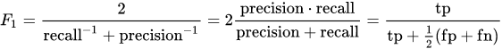
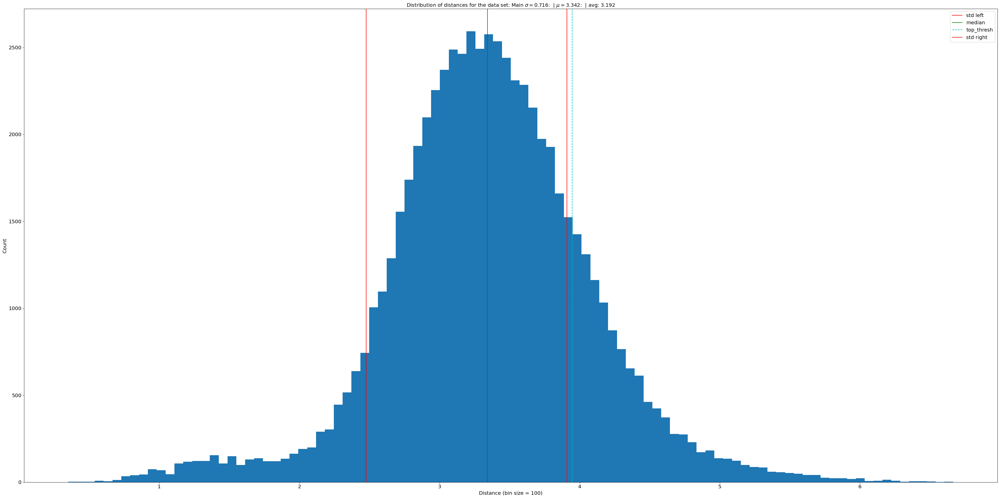
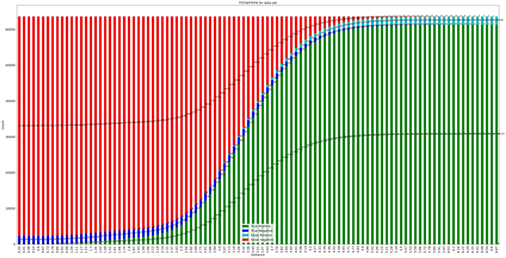

# Fishial.ai

This notebook shows insights of training experiments. 

---


**Trained Model Report**


1. **Data**

The training dataset consists of 63582 fish masks for 289 different classes. The most images belong to the class “sphyraena barracuda” - 535 images, and the least number belongs to Opisthonema oglinum - 44 images


2. **Model parameters.**

Feature Network (backbone): **ResNet18**

Classification Layer (embedding): **256 neurons**

Loss: **Quadruplet loss**

Setup: 

```yaml
model:
    backbone: "resnet18"
    embeddings: 256
    
dataset:  
    batchsampler:
        classes_per_batch: 18
        samples_per_class: 8
train:
    loss:
        name: 'qudruplet'
        adaptive_margin: False
    learning_rate: 0.015
    momentum: 0.9
    epoch: 4000
    warmup_steps: 500
    opt_level: 'O2'
device: 'cuda'

```


3. **Train results **




In order to better evaluate the mechanics of the trained network, we present the following graphs: A histogram of the distribution of distances for the whole data set and a change in the truth map depending on the distance threshold.

**coefficient variance: 0.2135811472904158**

**68–95–99.7 rule: |0.7241200339718789|0.9371048409927338|0.9880469315214998|**




Table of metrics for each class

|                                    |   precision |   recall |   f1-score |    support |
|:-----------------------------------|------------:|---------:|-----------:|-----------:|
| Opisthonema oglinum                |      1.0000 |   0.9773 |     0.9885 |    44.0000 |
| Sphyrna mokarran                   |      0.9375 |   0.9375 |     0.9375 |    48.0000 |
| Hiodon alosoides                   |      1.0000 |   0.9388 |     0.9684 |    49.0000 |
| Neogobius melanostomus             |      0.9800 |   0.9608 |     0.9703 |    51.0000 |
| Squalus acanthias                  |      0.9574 |   0.8824 |     0.9184 |    51.0000 |
| Leuciscus aspius                   |      0.9623 |   0.9623 |     0.9623 |    53.0000 |
| Xiphias gladius                    |      0.9630 |   0.9811 |     0.9720 |    53.0000 |
| Lutjanus cyanopterus               |      0.9464 |   0.9636 |     0.9550 |    55.0000 |
| Acroteriobatus annulatus           |      1.0000 |   0.9828 |     0.9913 |    58.0000 |
| Clupea harengus                    |      0.9123 |   0.8966 |     0.9043 |    58.0000 |
| Scaphirhynchus platorynchus        |      0.9825 |   0.9492 |     0.9655 |    59.0000 |
| Arripis truttacea                  |      0.9180 |   0.9333 |     0.9256 |    60.0000 |
| Micropterus notius                 |      0.9259 |   0.8333 |     0.8772 |    60.0000 |
| Scomberomorus commerson            |      1.0000 |   0.9677 |     0.9836 |    62.0000 |
| Carcharhinus obscurus              |      0.8030 |   0.8281 |     0.8154 |    64.0000 |
| Pterois volitans                   |      1.0000 |   1.0000 |     1.0000 |    68.0000 |
| Epinephelus itajara                |      0.8519 |   0.9857 |     0.9139 |    70.0000 |
| Mugil curema                       |      0.9851 |   0.9429 |     0.9635 |    70.0000 |
| Channa marulius                    |      0.9494 |   0.9615 |     0.9554 |    78.0000 |
| Nebrius ferrugineus                |      0.9200 |   0.8846 |     0.9020 |    78.0000 |
| Rhincodon typus                    |      0.9884 |   1.0000 |     0.9942 |    85.0000 |
| Aetobatus narinari                 |      0.9884 |   0.9884 |     0.9884 |    86.0000 |
| Coregonus clupeaformis             |      0.9432 |   0.9540 |     0.9486 |    87.0000 |
| Albula vulpes                      |      1.0000 |   0.9667 |     0.9831 |    90.0000 |
| Epinephelus malabaricus            |      0.9670 |   0.9362 |     0.9514 |    94.0000 |
| Platycephalus indicus              |      0.9072 |   0.9072 |     0.9072 |    97.0000 |
| Clarias gariepinus                 |      0.9528 |   0.9712 |     0.9619 |   104.0000 |
| Lepisosteus oculatus               |      0.9505 |   0.9231 |     0.9366 |   104.0000 |
| Anguilla anguilla                  |      0.7909 |   0.8286 |     0.8093 |   105.0000 |
| Carcharhinus plumbeus              |      0.8725 |   0.8476 |     0.8599 |   105.0000 |
| Enneacanthus gloriosus             |      0.9905 |   0.9905 |     0.9905 |   105.0000 |
| Leiostomus xanthurus               |      0.9904 |   0.9810 |     0.9856 |   105.0000 |
| Lepomis megalotis                  |      0.9623 |   0.9623 |     0.9623 |   106.0000 |
| Scorpaena guttata                  |      0.9901 |   0.9434 |     0.9662 |   106.0000 |
| Channa argus                       |      0.9905 |   0.9720 |     0.9811 |   107.0000 |
| Hephaestus fuliginosus             |      0.8774 |   0.8692 |     0.8732 |   107.0000 |
| Micropterus coosae                 |      0.9806 |   0.9439 |     0.9619 |   107.0000 |
| Opsanus tau                        |      0.9550 |   0.9815 |     0.9680 |   108.0000 |
| Paralabrax maculatofasciatus       |      0.9906 |   0.9722 |     0.9813 |   108.0000 |
| Paralichthys californicus          |      0.9706 |   0.9167 |     0.9429 |   108.0000 |
| Semotilus corporalis               |      0.9817 |   0.9907 |     0.9862 |   108.0000 |
| Carpiodes carpio                   |      0.9722 |   0.9633 |     0.9677 |   109.0000 |
| Macquaria ambigua                  |      1.0000 |   0.9908 |     0.9954 |   109.0000 |
| Oligoplites saurus                 |      1.0000 |   0.9725 |     0.9860 |   109.0000 |
| Thymallus thymallus                |      0.9444 |   0.9358 |     0.9401 |   109.0000 |
| Platichthys flesus                 |      0.9107 |   0.9273 |     0.9189 |   110.0000 |
| Semotilus atromaculatus            |      0.9815 |   0.9636 |     0.9725 |   110.0000 |
| Epinephelus tukula                 |      1.0000 |   0.9820 |     0.9909 |   111.0000 |
| Lutjanus fulviflamma               |      1.0000 |   0.9911 |     0.9955 |   112.0000 |
| Barbus barbus                      |      0.9541 |   0.9123 |     0.9327 |   114.0000 |
| Hypophthalmichthys molitrix        |      1.0000 |   0.9737 |     0.9867 |   114.0000 |
| Prosopium williamsoni              |      0.9818 |   0.9474 |     0.9643 |   114.0000 |
| Epinephelus marginatus             |      0.9737 |   0.9652 |     0.9694 |   115.0000 |
| Thymallus arcticus                 |      0.9727 |   0.9304 |     0.9511 |   115.0000 |
| Menticirrhus saxatilis             |      0.9732 |   0.9397 |     0.9561 |   116.0000 |
| Moxostoma macrolepidotum           |      0.9739 |   0.9655 |     0.9697 |   116.0000 |
| Blicca bjoerkna                    |      0.9569 |   0.9487 |     0.9528 |   117.0000 |
| Epinephelus lanceolatus            |      0.9561 |   0.9316 |     0.9437 |   117.0000 |
| Moxostoma anisurum                 |      0.9739 |   0.9573 |     0.9655 |   117.0000 |
| Sebastes melanops                  |      0.9748 |   0.9915 |     0.9831 |   117.0000 |
| Tautoga onitis                     |      0.9741 |   0.9658 |     0.9700 |   117.0000 |
| Tylosurus crocodilus               |      0.9565 |   0.9402 |     0.9483 |   117.0000 |
| Caranx sexfasciatus                |      0.9412 |   0.9492 |     0.9451 |   118.0000 |
| Cynoscion regalis                  |      1.0000 |   0.9661 |     0.9828 |   118.0000 |
| Labrus bergylta                    |      0.9829 |   0.9746 |     0.9787 |   118.0000 |
| Lutjanus gibbus                    |      0.9916 |   1.0000 |     0.9958 |   118.0000 |
| Pachymetopon blochii               |      0.9746 |   0.9746 |     0.9746 |   118.0000 |
| Scomber japonicus                  |      0.9237 |   0.9237 |     0.9237 |   118.0000 |
| Epinephelus striatus               |      0.9915 |   0.9832 |     0.9873 |   119.0000 |
| Gadus morhua                       |      0.9829 |   0.9664 |     0.9746 |   119.0000 |
| Lutjanus argentiventris            |      0.9739 |   0.9412 |     0.9573 |   119.0000 |
| Scarus guacamaia                   |      0.9832 |   0.9832 |     0.9832 |   119.0000 |
| Sphoeroides maculatus              |      0.9916 |   0.9916 |     0.9916 |   119.0000 |
| Belone belone                      |      0.8468 |   0.8750 |     0.8607 |   120.0000 |
| Elagatis bipinnulata               |      1.0000 |   1.0000 |     1.0000 |   120.0000 |
| Lutjanus decussatus                |      1.0000 |   1.0000 |     1.0000 |   120.0000 |
| Micropterus treculii               |      0.9153 |   0.9000 |     0.9076 |   120.0000 |
| Myliobatis aquila                  |      0.9720 |   0.8667 |     0.9163 |   120.0000 |
| Paralabrax nebulifer               |      1.0000 |   0.9917 |     0.9958 |   120.0000 |
| Plectropomus laevis                |      1.0000 |   0.9917 |     0.9958 |   120.0000 |
| Pollachius pollachius              |      0.9914 |   0.9583 |     0.9746 |   120.0000 |
| Amphistichus argenteus             |      1.0000 |   1.0000 |     1.0000 |   121.0000 |
| Epinephelus merra                  |      0.9917 |   0.9835 |     0.9876 |   121.0000 |
| Macquaria novemaculeata            |      0.9914 |   0.9504 |     0.9705 |   121.0000 |
| Dasyatis pastinaca                 |      0.6729 |   0.5902 |     0.6288 |   122.0000 |
| Gymnosarda unicolor                |      0.9917 |   0.9754 |     0.9835 |   122.0000 |
| Ptychocheilus oregonensis          |      0.9916 |   0.9672 |     0.9793 |   122.0000 |
| Salvelinus confluentus             |      0.9913 |   0.9344 |     0.9620 |   122.0000 |
| Sparisoma rubripinne               |      1.0000 |   0.9918 |     0.9959 |   122.0000 |
| Cantherhines pullus                |      1.0000 |   1.0000 |     1.0000 |   123.0000 |
| Sander lucioperca                  |      0.9741 |   0.9187 |     0.9456 |   123.0000 |
| Acipenser transmontanus            |      0.9600 |   0.9677 |     0.9639 |   124.0000 |
| Carcharhinus melanopterus          |      0.9837 |   0.9758 |     0.9798 |   124.0000 |
| Silurus glanis                     |      0.9655 |   0.9032 |     0.9333 |   124.0000 |
| Anisotremus surinamensis           |      0.9920 |   0.9920 |     0.9920 |   125.0000 |
| Epinephelus coioides               |      0.9758 |   0.9680 |     0.9719 |   125.0000 |
| Scyliorhinus canicula              |      0.9919 |   0.9760 |     0.9839 |   125.0000 |
| Atractosteus spatula               |      0.9590 |   0.9286 |     0.9435 |   126.0000 |
| Ophiodon elongatus                 |      0.9683 |   0.9683 |     0.9683 |   126.0000 |
| Prionotus evolans                  |      1.0000 |   1.0000 |     1.0000 |   126.0000 |
| Rhomboplites aurorubens            |      0.9921 |   0.9843 |     0.9881 |   127.0000 |
| Carcharhinus leucas                |      0.8657 |   0.9062 |     0.8855 |   128.0000 |
| Salmo salar                        |      0.9055 |   0.8984 |     0.9020 |   128.0000 |
| Esox americanus americanus         |      0.9440 |   0.9147 |     0.9291 |   129.0000 |
| Stenotomus chrysops                |      0.9839 |   0.9457 |     0.9644 |   129.0000 |
| Triakis semifasciata               |      0.9923 |   1.0000 |     0.9961 |   129.0000 |
| Rhabdosargus sarba                 |      0.9846 |   0.9846 |     0.9846 |   130.0000 |
| Merlangius merlangus               |      0.9690 |   0.9542 |     0.9615 |   131.0000 |
| Sebastes miniatus                  |      0.9923 |   0.9847 |     0.9885 |   131.0000 |
| Scorpaenichthys marmoratus         |      0.9692 |   0.9545 |     0.9618 |   132.0000 |
| Lota lota                          |      0.9771 |   0.9624 |     0.9697 |   133.0000 |
| Lutjanus fulvus                    |      1.0000 |   1.0000 |     1.0000 |   133.0000 |
| Lutjanus jocu                      |      0.9697 |   0.9624 |     0.9660 |   133.0000 |
| Makaira nigricans                  |      0.9621 |   0.9549 |     0.9585 |   133.0000 |
| Pagrus auratus                     |      0.9852 |   1.0000 |     0.9925 |   133.0000 |
| Pseudopleuronectes americanus      |      0.9270 |   0.9549 |     0.9407 |   133.0000 |
| Synodus foetens                    |      0.9851 |   0.9925 |     0.9888 |   133.0000 |
| Acanthopagrus butcheri             |      0.9160 |   0.8955 |     0.9057 |   134.0000 |
| Acipenser fulvescens               |      0.9690 |   0.9328 |     0.9506 |   134.0000 |
| Cephalopholis miniata              |      0.9925 |   0.9925 |     0.9925 |   134.0000 |
| Mustelus canis                     |      0.9259 |   0.9328 |     0.9294 |   134.0000 |
| Nocomis micropogon                 |      0.9779 |   0.9925 |     0.9852 |   134.0000 |
| Oncorhynchus nerka                 |      0.9078 |   0.9552 |     0.9309 |   134.0000 |
| Raja clavata                       |      1.0000 |   0.9776 |     0.9887 |   134.0000 |
| Caranx melampygus                  |      0.9925 |   0.9852 |     0.9888 |   135.0000 |
| Arripis trutta                     |      0.9776 |   0.9632 |     0.9704 |   136.0000 |
| Carassius carassius                |      0.9085 |   0.9485 |     0.9281 |   136.0000 |
| Centropristis striata              |      1.0000 |   0.9926 |     0.9963 |   136.0000 |
| Lutjanus bohar                     |      0.9925 |   0.9779 |     0.9852 |   136.0000 |
| Seriola lalandi                    |      0.9774 |   0.9559 |     0.9665 |   136.0000 |
| Paralabrax clathratus              |      0.9856 |   1.0000 |     0.9928 |   137.0000 |
| Istiophorus albicans               |      0.9776 |   0.9493 |     0.9632 |   138.0000 |
| Menticirrhus americanus            |      0.9771 |   0.9275 |     0.9517 |   138.0000 |
| Trachinotus goodei                 |      1.0000 |   0.9638 |     0.9815 |   138.0000 |
| Epinephelus fasciatus              |      1.0000 |   0.9929 |     0.9964 |   141.0000 |
| Lates calcarifer                   |      1.0000 |   0.9929 |     0.9964 |   141.0000 |
| Triaenodon obesus                  |      0.9926 |   0.9574 |     0.9747 |   141.0000 |
| Hippoglossus stenolepis            |      0.9930 |   1.0000 |     0.9965 |   142.0000 |
| Carcharias taurus                  |      0.9857 |   0.9650 |     0.9753 |   143.0000 |
| Oncorhynchus gorbuscha             |      0.9493 |   0.9161 |     0.9324 |   143.0000 |
| Sander canadensis                  |      0.9851 |   0.9231 |     0.9531 |   143.0000 |
| Cyprinus rubrofuscus               |      0.9640 |   0.9306 |     0.9470 |   144.0000 |
| Dorosoma cepedianum                |      0.9931 |   0.9931 |     0.9931 |   144.0000 |
| Oncorhynchus tshawytscha           |      0.9545 |   0.8750 |     0.9130 |   144.0000 |
| Scomberomorus regalis              |      0.9930 |   0.9792 |     0.9860 |   144.0000 |
| Maccullochella peelii              |      0.9932 |   1.0000 |     0.9966 |   146.0000 |
| Oncorhynchus keta                  |      0.9583 |   0.9452 |     0.9517 |   146.0000 |
| Gnathanodon speciosus              |      0.9933 |   1.0000 |     0.9966 |   148.0000 |
| Sparisoma aurofrenatum             |      0.9933 |   1.0000 |     0.9967 |   149.0000 |
| Tilapia sparrmanii                 |      0.9803 |   0.9933 |     0.9868 |   150.0000 |
| Alosa sapidissima                  |      0.9603 |   0.9603 |     0.9603 |   151.0000 |
| Canthigaster rostrata              |      1.0000 |   0.9934 |     0.9967 |   152.0000 |
| Centrarchus macropterus            |      0.9934 |   0.9868 |     0.9901 |   152.0000 |
| Mycteroperca bonaci                |      0.9679 |   0.9934 |     0.9805 |   152.0000 |
| Carcharodon carcharias             |      0.9730 |   0.9412 |     0.9568 |   153.0000 |
| Lutjanus mahogoni                  |      0.9308 |   0.9673 |     0.9487 |   153.0000 |
| Channa striata                     |      0.9673 |   0.9610 |     0.9642 |   154.0000 |
| Bodianus rufus                     |      0.9936 |   1.0000 |     0.9968 |   155.0000 |
| Micropterus floridanus             |      0.8693 |   0.8526 |     0.8608 |   156.0000 |
| Lepomis punctatus                  |      0.9868 |   0.9554 |     0.9709 |   157.0000 |
| Cnidoglanis macrocephalus          |      1.0000 |   0.9811 |     0.9905 |   159.0000 |
| Heterodontus portusjacksoni        |      1.0000 |   1.0000 |     1.0000 |   169.0000 |
| Oncorhynchus clarkii               |      0.8917 |   0.8284 |     0.8589 |   169.0000 |
| Sarda sarda                        |      0.9766 |   0.9882 |     0.9824 |   169.0000 |
| Sparisoma viride                   |      0.9942 |   0.9770 |     0.9855 |   174.0000 |
| Ictiobus bubalus                   |      0.9721 |   0.9943 |     0.9831 |   175.0000 |
| Variola louti                      |      0.9943 |   0.9886 |     0.9914 |   175.0000 |
| Euthynnus alletteratus             |      0.9884 |   0.9659 |     0.9770 |   176.0000 |
| Abudefduf saxatilis                |      0.9944 |   1.0000 |     0.9972 |   177.0000 |
| Menidia menidia                    |      0.9728 |   0.9944 |     0.9835 |   180.0000 |
| Anguilla rostrata                  |      0.9133 |   0.8729 |     0.8927 |   181.0000 |
| Alectis ciliaris                   |      1.0000 |   0.9892 |     0.9946 |   185.0000 |
| Caranx latus                       |      0.9454 |   0.9351 |     0.9402 |   185.0000 |
| Rhizoprionodon terraenovae         |      0.9043 |   0.9043 |     0.9043 |   188.0000 |
| Epinephelus morio                  |      0.9841 |   0.9841 |     0.9841 |   189.0000 |
| Morone mississippiensis            |      0.9799 |   0.9898 |     0.9848 |   197.0000 |
| Scardinius erythrophthalmus        |      0.8990 |   0.9036 |     0.9013 |   197.0000 |
| Scomber scombrus                   |      0.9500 |   0.9548 |     0.9524 |   199.0000 |
| Ameiurus catus                     |      0.8798 |   0.8673 |     0.8735 |   211.0000 |
| Mycteroperca microlepis            |      0.9858 |   0.9811 |     0.9835 |   212.0000 |
| Seriola rivoliana                  |      0.9423 |   0.9202 |     0.9311 |   213.0000 |
| Carcharhinus limbatus              |      0.8318 |   0.8551 |     0.8433 |   214.0000 |
| Thunnus atlanticus                 |      0.9484 |   0.9395 |     0.9439 |   215.0000 |
| Cyprinus carpio carpio             |      0.9771 |   0.9771 |     0.9771 |   218.0000 |
| Strongylura marina                 |      0.9134 |   0.9254 |     0.9194 |   228.0000 |
| Morone chrysops X Morone saxatilis |      0.8690 |   0.8652 |     0.8671 |   230.0000 |
| Lachnolaimus maximus               |      1.0000 |   0.9827 |     0.9913 |   231.0000 |
| Sphyrna tiburo                     |      0.9571 |   0.9571 |     0.9571 |   233.0000 |
| Lepisosteus platyrhincus           |      0.9661 |   0.9702 |     0.9682 |   235.0000 |
| Lobotes surinamensis               |      1.0000 |   0.9916 |     0.9958 |   237.0000 |
| Lutjanus argentimaculatus          |      0.9578 |   0.9578 |     0.9578 |   237.0000 |
| Cephalopholis cruentata            |      0.9712 |   0.9916 |     0.9813 |   238.0000 |
| Rachycentron canadum               |      0.9794 |   0.9917 |     0.9855 |   240.0000 |
| Carassius auratus                  |      0.9259 |   0.9336 |     0.9298 |   241.0000 |
| Ginglymostoma cirratum             |      0.9476 |   0.9631 |     0.9553 |   244.0000 |
| Oncorhynchus kisutch               |      0.8821 |   0.9469 |     0.9134 |   245.0000 |
| Salvelinus namaycush               |      0.9759 |   0.9838 |     0.9798 |   247.0000 |
| Parachromis managuensis            |      0.9665 |   0.9924 |     0.9793 |   262.0000 |
| Ctenopharyngodon idella            |      0.9808 |   0.9734 |     0.9771 |   263.0000 |
| Paralichthys lethostigma           |      0.8736 |   0.8636 |     0.8686 |   264.0000 |
| Platycephalus fuscus               |      0.9590 |   0.9662 |     0.9625 |   266.0000 |
| Astronotus ocellatus               |      0.9926 |   0.9889 |     0.9907 |   270.0000 |
| Esox masquinongy                   |      0.9849 |   0.9631 |     0.9739 |   271.0000 |
| Bagre marinus                      |      0.9779 |   0.9743 |     0.9761 |   272.0000 |
| Micropterus punctulatus            |      0.9091 |   0.9191 |     0.9141 |   272.0000 |
| Pylodictis olivaris                |      0.9636 |   0.9532 |     0.9584 |   278.0000 |
| Paralichthys dentatus              |      0.8606 |   0.8667 |     0.8636 |   285.0000 |
| Caranx ignobilis                   |      0.9795 |   0.9862 |     0.9828 |   290.0000 |
| Morone chrysops                    |      0.8908 |   0.8908 |     0.8908 |   293.0000 |
| Selene vomer                       |      0.9967 |   1.0000 |     0.9984 |   304.0000 |
| Lutjanus campechanus               |      0.9838 |   0.9934 |     0.9886 |   305.0000 |
| Dicentrarchus labrax               |      0.9806 |   0.9902 |     0.9854 |   306.0000 |
| Abramis brama                      |      0.9681 |   0.9806 |     0.9743 |   309.0000 |
| Scomberomorus maculatus            |      0.9654 |   0.9777 |     0.9715 |   314.0000 |
| Oreochromis aureus                 |      0.9748 |   0.9778 |     0.9763 |   316.0000 |
| Lutjanus synagris                  |      0.9808 |   0.9685 |     0.9746 |   317.0000 |
| Ictalurus furcatus                 |      0.9586 |   0.9262 |     0.9421 |   325.0000 |
| Thunnus albacares                  |      0.9520 |   0.9754 |     0.9635 |   325.0000 |
| Morone americana                   |      0.9585 |   0.9848 |     0.9714 |   328.0000 |
| Carangoides bartholomaei           |      0.9704 |   0.9939 |     0.9820 |   330.0000 |
| Scomberomorus cavalla              |      0.9669 |   0.9669 |     0.9669 |   332.0000 |
| Lepisosteus osseus                 |      0.9714 |   0.9827 |     0.9770 |   346.0000 |
| Caranx crysos                      |      0.9780 |   0.9944 |     0.9861 |   357.0000 |
| Haemulon plumierii                 |      0.9917 |   0.9944 |     0.9931 |   360.0000 |
| Megalops atlanticus                |      0.9837 |   0.9864 |     0.9850 |   367.0000 |
| Elops saurus                       |      0.9947 |   0.9947 |     0.9947 |   374.0000 |
| Acanthocybium solandri             |      0.9742 |   0.9947 |     0.9843 |   379.0000 |
| Lutjanus analis                    |      0.9947 |   0.9868 |     0.9907 |   379.0000 |
| Mugil cephalus                     |      0.9767 |   0.9869 |     0.9818 |   383.0000 |
| Tinca tinca                        |      0.9852 |   0.9901 |     0.9876 |   403.0000 |
| Anisotremus virginicus             |      1.0000 |   1.0000 |     1.0000 |   423.0000 |
| Trachinotus falcatus               |      0.9654 |   0.9905 |     0.9778 |   423.0000 |
| Acanthurus chirurgus               |      0.9860 |   0.9883 |     0.9872 |   429.0000 |
| Ocyurus chrysurus                  |      1.0000 |   1.0000 |     1.0000 |   430.0000 |
| Salmo trutta                       |      0.9767 |   0.9699 |     0.9733 |   432.0000 |
| Cynoscion nebulosus                |      0.9908 |   1.0000 |     0.9954 |   433.0000 |
| Seriola dumerili                   |      0.9521 |   0.9630 |     0.9575 |   433.0000 |
| Centropomus undecimalis            |      1.0000 |   1.0000 |     1.0000 |   434.0000 |
| Ambloplites rupestris              |      0.9955 |   1.0000 |     0.9977 |   439.0000 |
| Lepomis cyanellus                  |      0.9931 |   0.9886 |     0.9909 |   439.0000 |
| Pomoxis annularis                  |      0.9702 |   0.9636 |     0.9669 |   439.0000 |
| Sander vitreus                     |      0.9519 |   0.9864 |     0.9688 |   441.0000 |
| Cymatogaster aggregata             |      0.9909 |   0.9887 |     0.9898 |   442.0000 |
| Aplodinotus grunniens              |      0.9711 |   0.9865 |     0.9787 |   443.0000 |
| Caranx hippos                      |      0.9730 |   0.9752 |     0.9741 |   443.0000 |
| Esox niger                         |      0.9532 |   0.9661 |     0.9596 |   443.0000 |
| Ameiurus melas                     |      0.8348 |   0.8536 |     0.8441 |   444.0000 |
| Amia calva                         |      0.9772 |   0.9662 |     0.9717 |   444.0000 |
| Cyprinus carpio                    |      0.9550 |   0.9550 |     0.9550 |   444.0000 |
| Lagodon rhomboides                 |      0.9978 |   0.9978 |     0.9978 |   445.0000 |
| Perca flavescens                   |      0.9649 |   0.9888 |     0.9767 |   445.0000 |
| Pomoxis nigromaculatus             |      0.9710 |   0.9775 |     0.9742 |   445.0000 |
| Micropogonias undulatus            |      0.9800 |   0.9910 |     0.9855 |   446.0000 |
| Lepomis gulosus                    |      0.9709 |   0.9687 |     0.9698 |   447.0000 |
| Lutjanus apodus                    |      0.9889 |   0.9889 |     0.9889 |   449.0000 |
| Perca fluviatilis                  |      0.9932 |   0.9800 |     0.9865 |   449.0000 |
| Ariopsis felis                     |      0.9522 |   0.9733 |     0.9626 |   450.0000 |
| Ictalurus punctatus                |      0.9145 |   0.9267 |     0.9205 |   450.0000 |
| Ameiurus natalis                   |      0.9074 |   0.8914 |     0.8993 |   451.0000 |
| Caranx ruber                       |      0.9865 |   0.9734 |     0.9799 |   451.0000 |
| Catostomus commersonii             |      0.9615 |   0.9956 |     0.9782 |   451.0000 |
| Cichla ocellaris                   |      1.0000 |   0.9956 |     0.9978 |   451.0000 |
| Hypanus sabinus                    |      0.9145 |   0.9246 |     0.9195 |   451.0000 |
| Rutilus rutilus                    |      0.9532 |   0.9490 |     0.9511 |   451.0000 |
| Trachinotus carolinus              |      0.9865 |   0.9756 |     0.9810 |   451.0000 |
| Ameiurus nebulosus                 |      0.8475 |   0.8850 |     0.8658 |   452.0000 |
| Balistes capriscus                 |      0.9978 |   1.0000 |     0.9989 |   452.0000 |
| Orthopristis chrysoptera           |      0.9955 |   0.9845 |     0.9900 |   452.0000 |
| Acanthopagrus australis            |      0.9565 |   0.9713 |     0.9639 |   453.0000 |
| Hypanus americanus                 |      0.7963 |   0.8543 |     0.8243 |   453.0000 |
| Lepomis microlophus                |      0.9713 |   0.9713 |     0.9713 |   453.0000 |
| Morone saxatilis                   |      0.9912 |   0.9890 |     0.9901 |   454.0000 |
| Pomatomus saltatrix                |      0.9846 |   0.9846 |     0.9846 |   454.0000 |
| Archosargus probatocephalus        |      0.9956 |   0.9912 |     0.9934 |   455.0000 |
| Mayaheros urophthalmus             |      0.9889 |   0.9824 |     0.9857 |   455.0000 |
| Lepomis gibbosus                   |      0.9548 |   0.9737 |     0.9642 |   456.0000 |
| Lepomis macrochirus                |      0.9581 |   0.9518 |     0.9549 |   456.0000 |
| Lutjanus griseus                   |      0.9759 |   0.9781 |     0.9770 |   456.0000 |
| Esox lucius                        |      0.9631 |   0.9694 |     0.9663 |   458.0000 |
| Coryphaena hippurus                |      0.9893 |   0.9914 |     0.9904 |   466.0000 |
| Lepomis auritus                    |      0.9831 |   0.9894 |     0.9862 |   470.0000 |
| Sphyraena barracuda                |      0.9849 |   0.9682 |     0.9764 |   471.0000 |
| Herichthys cyanoguttatus           |      0.9711 |   0.9812 |     0.9761 |   479.0000 |
| Pogonias cromis                    |      0.9778 |   0.9858 |     0.9818 |   492.0000 |
| Micropterus dolomieu               |      0.9655 |   0.9749 |     0.9702 |   517.0000 |
| Micropterus salmoides              |      0.9160 |   0.9249 |     0.9204 |   519.0000 |
| Salvelinus fontinalis              |      0.9715 |   0.9771 |     0.9743 |   523.0000 |
| Oncorhynchus mykiss                |      0.9164 |   0.9373 |     0.9267 |   526.0000 |
| Sciaenops ocellatus                |      0.9925 |   0.9925 |     0.9925 |   535.0000 |
| avg / total                        |      0.9643 |   0.9641 |     0.9641 | 63582.0000 |

<p float="left">
  
   
  
  
</p>


## License

[MIT](https://choosealicense.com/licenses/mit/)

